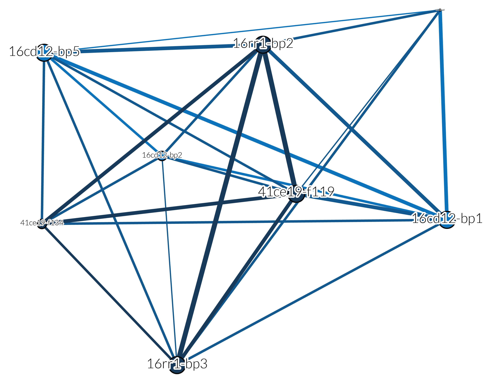

>Studying the history of paper exposes a number of historical misconceptions, the most important of which is this technological fallacy: the idea that technology changes society. It is exactly the reverse. Society develops technology to address the chages that are taking place within it \citep[xiv]{RN10878}.

# Introduction

The presence of large bifaces as part of lithic assemblages across the American Southeast originated during the Early to Middle Archaic period, was associated with several major cultural and technological changes, and continued into the Woodland and Mississippian periods. Cultural changes coincided with shifts in residential mobility, and abbreviated territories. The major characteristics of Middle Archaic organization that aided in setting the stage for an emphasis on large bifaces included: (1) decreased scale of land use; (2) increased emphasis on local raw material sources; (3) an emphasis on expediency; and (4) an increase in residential mobility (Amick and Carr 1996:53). Across the American Southeast from the Middle to Late Archaic was an increasing emphasis on the use of certain nonlocal raw materials, some aspects of the technology became less expedient with a greater reliance on hafting and bifaces and increased logistical mobility. Concomitant with a period of decreased scales of land use, limited areal mobility, and technological shifts emphasizing larger hafted bifaces and specific raw materials, social and economic factors fostered the development of complex and large-scale exchange networks across the region (Jeffries 1996:223). Increasing sedentism across the Archaic period into the Woodland and Mississippian periods may have been connected to strategies associated with the maintenance of territorial boundaries and spacing between adjacent groups (Brown 1985:224; Rolingson and Mainfort, Jr., 2002). Brose (1979:6) noted that stylistic marker items often appear among similar ethnic groups occupying the same cultural-ecological system. The presence of boundaries, formalized by exchange relationships and codified by stylistic markers (artefacts) contributed to ecological stability, access to important resources, and group protection (Jeffries 1996:227).

Sassaman (2010:99-105) provides an excellent survey of the large bifaces in the American Southeast that were key items of large regional exchange networks and interaction spheres. Formal hafted bifaces were characteristic of the entire Archaic period. These items typically functioned as knives, projectile points, and cores in both hafted and unhafted forms. Large bifaces also functioned and fulfilled major symbolic roles as exchange items, individual status markers, and as mortuary items, in addition to their functional roles in subsistence and defense. Consequently, the procurement of raw materials and manufacture of formal hafted and unhafted bifaces often exhibited unique characteristics: exotic and nonlocal raw materials, exaggerations of form, and mass manufacture by craft specialists in dedicated workshop areas. Those bifaces that were incorporated into ceremonial contexts were often used in mortuary functions as grave goods, dedicatory caches for mound building or mortuary purposes, ceremonially broken or burned. A variety of formal biface types across the Archaic period functioned in non-subsistence roles (Sassaman 2010). These included the large Dalton points in the central Mississippi Valley (Futato 1983; Gramly and Funk 1991; Morse 1997), Benton points and cache blades of the middle Tennessee River valley and northern Alabama and Mississippi (Johnson and Brooks 1989), Middle Archaic biface caches of the Midwestern mortuary complexes in Illinois and Missouri areas (see Hassen and Farnsworth 1987; O’Brien and Wood 1998), Susquehanna biface traditions along the Eastern Seaboard and Middle Atlantic coast (Dincauze 1968), and Red Ochre cache blades along the Ohio and Illinois River valleys  and extending into the northeastern United States (see Granger 1978; Pleger 2000). In some areas of the United States, these traditions of large formal bifaces continued into the Woodland and Mississippian periods and are inclusive of the Gahagan and Copena types \citep{RN8154,RN8318}. Sassaman (2010:104-105) duly notes that the presence of bifaces in burials or their inclusion as nonmortuary offerings or caches is not unique to the Archaic period. However, the manufacture and caching of very large bifaces, unusual forms, or large numbers of preforms appears to have occurred in a limited number of areas for short durations of time. He also noted that there was a general trend across the Archaic and later time periods for a diminution in biface size, and an increase in the number of bifaces included in large caches (Sassaman 2010:105). For many of these biface traditions, it was common to include smaller and more worn or utilized examples as components to the cache or mortuary feature. This dichotomy of bifaces, while not understood, was undoubtedly significant to the event, and may have indicated that the spatial separation of the dead from the living was not entirely clear. Gahagan and Copena biface styles and their use in mortuary and non-mortuary ceremonial or dedicatory cache offerings may be representative of a decline in the use/value of large bifaces in the American Southeast, a phenomenon thought to have begun during the Late Paleoindian-Early Archaic Transition, reaching its culmination during the Middle to Late Archaic.

Found to occur along the western margin of the American Southeast, Gahagan bifaces are among the most recognizable elements of Caddo material culture, and were regularly included with burial offerings during the Formative (CE 800-1000) and Early (CE 1000-1250) Caddo periods \citep{RN7115,RN8189,RN5746,RN8186,RN8174,RN8176}. Recent efforts to characterize general trends associated with Gahagan biface morphology yielded support for a spatial boundary that divides the northern and southern Caddo behavioral regions based upon morphological differences that occur in Caddo bottles, Gahagan bifaces, and Perdiz arrow points (**`Chapter X, Figure 1c`**) \citep{RN7925,RN8071,RN8361,RN8967,RN11064,RN8154}. A second spatial boundary has also been posited based upon differences in Gahagan biface morphology between the Caddo and central Texas regions \citep{RN8318}.

```{r gahagan bifaces 2D, out.width = "80%", fig.align="center", dpi = 300, echo=FALSE, warning=FALSE, fig.cap="Gahagan bifaces from the northern and southern Caddo behavioral regions. Bifaces recovered atop or alongside an individual denoted by black dot. For reference to scale, the Gahagan biface at bottom left (m3) measures 48cm in length. Additional information for each biface, including the option to download full-resolution 2D images of individual bifaces, can be found at https://scholarworks.sfasu.edu/ita-gahaganbiface/."}
knitr::include_graphics('img/fig02.jpg')
```

# Contexts of recovery

All Gahagan bifaces used in the analysis were recovered from Caddo burial contexts excavated between 1912 and 1969. Stratigraphic contexts were used to delimit temporal contexts, although the temporal span between these events remains unclear. Additional contextual information was used to identify Gahagan bifaces that were placed _atop or alongside an individual_, or _in caches along the northern wall of the burial pit_.

## Mounds Plantation (16CD12)

There is a contextual difference between Gahagan bifaces from Mound 5 at the Mounds Plantation site (Figure 2:a\textsubscript{1}-l\textsubscript{1}), where those from burials included during mound development and/or construction (Burial Pits 1, 5, and 8) might be contrasted with those from Burial Pit 2 which was excavated into the corner of Burial Pit 1, cutting downward from the mound's surface [@RN8174]. The stratigraphic position of Burial Pit 2 indicates that this burial may have occurred subsequent to those associated with Burial Pits 1, 5, and 8 [@RN8174].

## Gahagan Mound (16RR1)
Gahagan bifaces were identified in 1911 from Deposits 1, 2, and 3 of Burial Pit 1 at the Gahagan Mound site in northwest Louisiana by \citet[Figures 18-19, 21]{RN7115}. A subsequent excavation at the Gahagan Mound site in 1936 identified two additional burial features containing Gahagan bifaces (Burial Pits 2 and 3) (Figure 2:a\textsubscript{2}-ee\textsubscript{2}) \citep[Plate 27]{RN8176}, and the entirety of the Gahagan Mound site was destroyed by the meander of the Red River between four and five years after the excavation of Burial Pits 2 and 3 \citep{RN10759}.

## George C. Davis (41CE19)

To assess the temporal change in preference between caches of Gahagan bifaces recovered from Mound C at the George C. Davis site, those from Feature 134 are contrasted with those from Feature 119 (Figure 2:a\textsubscript{3}-y\textsubscript{3}) [@RN5746;@RN8186]. The stratigraphic position of Feature 119 indicates that the burials in that feature occurred subsequent to those associated with Feature 134 [@RN5746;@RN8186].

# Methods and results

## Network analysis


```{r associated.net, out.width = "80%", fig.align="center", dpi = 300, echo=FALSE, warning=FALSE, fig.cap="Network of associated diagnostic artifacts recovered with Gahagan bifaces. Nodes are sized by degree, meaning that the larger nodes articulate with a greater number of connections. Node color is defined by the northern (light blue) or southern (dark blue) behavioral regions. Edges are weighted by size and color, meaning that thicker and darker lines represent a greater number diagnostic artifacts that are co-present between contexts."}

```

\begin{table}
\tbl{Diagnostic artifact types from Caddo burials found in association with Gahagan bifaces.}
{\begin{tabular}{ll} \toprule
Contexts & Diagnostics \\
\midrule
16CD12-BP1 & AL, CA, CC, FR, HA, HE, HFE \\
16CD12-BP2 & AL, HA \\
16CD12-BP5 & AL, FR, HA, SC \\
16CD12-BP8 & CA, HE, HFE, SC \\
16RR1-BP2 & AL, C, HA, HFE, HR, KI, SC \\
16RR1-BP3 & AL, C, HFE, SC \\
41CE19-F119 & AL, C, HA, HFE \\
41CE19-F134 & AL, C, HA \\
\bottomrule
\end{tabular}}
\tabnote{Associated diagnostic artifacts from Caddo burial contexts at the Mounds Plantation (16CD12), Gahagan Mound (16RR1), and George C. Davis (41CE19) sites include Alba arrow points (AL), celts (C), Catahoula arrow points (CA), Coles Creek ceramics (CC), Friley arrow points (FR), Gahagan bifaces (GB), Hayes arrow points (HA), Hickory Engraved ceramics (HE), Holly Fine Engraved ceramics (HFE), Harrell arrow points (HR), Kiam Incised ceramics (KI), and Scallorn arrow points (SC).}
\label{sample-table}
\end{table}

## Seriation


```{r h1a, out.width = "80%", dpi = 300, echo = FALSE, fig.align="center", fig.cap = "Results of the seriation of Caddo mortuary contexts. Additional information related to the seriation, including those data and code needed to reproduce these results, can be found in the supplemental materials at: https://seldenlab.github.io/gahaganmorph.3/."}
knitr::include_graphics('img/fig03.png')
```

## Assemblage diversity

**Caddo mortuary assemblages associated with Gahagan bifaces increase in diversity subsequent to their initial use as mortuary offerings.**

## 3D geometric morphometrics

Data collection procedures are outlined in \cite{RN8154} and \cite{RN8318}. Characteristic points and tangents used in the landmarking protocol were inspired by the work of \cite{RN5700}, and the landmarking protocol is discussed in detail in the [supplementary materials](https://seldenlab.github.io/gahaganmorph.3/). 

Landmarks were aligned to a global coordinate system \citep{RN8102,RN8587,RN8384}, achieved through generalized Procrustes superimposition \citep{RN8525}, performed in R 4.1.1 \citep{RN8584} using the `geomorph` package v4.0.1 \citep{RN8565,RN9565}. Procrustes superimposition translates, scales, and rotates coordinate data allowing for comparisons among objects \citep{RN5698,RN8525}. The `geomorph` package uses a partial Procrustes superimposition that projects the aligned specimens into tangent space subsequent to alignment in preparation for the use of multivariate methods that assume linear space \citep{RN8511,RN8384}.

### Object placement

**Gahagan bifaces included in Caddo burials as part of a cache differ in morphology from those placed atop or alongside an individual.**

This hypothesis was tested using Gahagan bifaces from two discrete Caddo burial practices; one interred as part of a _cache_, and the other placed atop or alongside _individuals_. Distinct Caddo burial practices may have been constrained by local morphological requirements, highlighting aspects of differential design intent.

Principal components analysis \citep{RN8576,RN10875} was used to visualize shape variation among bifaces from _individual_ and _cache_ contexts. Shape differences described by each principal axis are commonly visualized using thin-plate spline warping of landmarks or the reference 3D mesh \citep{RN8555,RN8553}. A residual randomization permutation procedure (RRPP; n = 10,000 permutations) was used for Procrustes ANOVAs \citep{RN8579,RN8334}, which has higher statistical power and a greater ability to identify patterns in the data should they be present \citep{RN6995}. To assess whether shape differs by context, Procrustes ANOVAs \citep{RN7046} were run that enlist effect-sizes (z-scores) computed as standard deviates of the generated sampling distributions \citep{RN8477}. Procrustes variance was used to discriminate between contexts for a comparison of shape variance (morphological disparity) \citep{RN5694}, estimated as Procrustes variance using residuals of linear model fit \citep{RN8565,RN9565}. The omparison of mean consensus configurations was subsequently used to visualize shape variation in Gahagan bifaces recovered from the two burial contexts.

Procrustes ANOVA results indicate a significant difference in Gahagan biface shape by context (RRPP = 10,000; Rsq = 0.21033; Pr(>F) = 1e-04) (Figure 4), and the test for differences in (centroid) size by context did not yield a significant result (RRPP = 10,000; Rsq = 0.01138; Pr(>F) = 0.3933). The test for morphological disparity by biface size yielded a significant result, indicating that the size of bifaces interred atop or alongside an _individual_ occupy a significantly greater range of morphospace than those interred as part of a _cache_.

```{r mshape.bpractice, out.width = "90%", fig.align="center", dpi = 300, echo=FALSE, warning=FALSE, fig.cap="The difference between Gahagan bifaces from cache and individual contexts is characterized by a narrower base, and a reduction in the flexuous blade shape (recurve) for bifaces found atop or alongside Caddo individuals. In the comparison of mean shapes by context, caches are presented in gray, and individuals in black."}
knitr::include_graphics('img/fig05.jpg')
```

### Temporal trajectories

**Gahagan bifaces from _individual_ and _cache_ contexts differ through time---_initial_ vs. _subsequent_ deposition---as mortuary assemblage diversity increases.**

# Discussion

Chronometric dates associated with contexts yielding Gahagan bifaces leave much to be desired, and it is not possible at this time to order the burial contexts sequentially using the available chronometric data.

## Gahagan biface morphology differs by burial context

The hypothesis that _Gahagan bifaces included in Caddo burials as a cache differ in morphology from those placed atop or alongside an individual_ was tested using Gahagan bifaces that articulate with two distinct Caddo burial practices; one interred as part of a _cache_, and the other placed atop or alongside _individuals_. Burial practices may have been constrained by local morphological requirements, highlighting aspects of differential design intent.

Results highlight a significant difference in shape--but not size--for Gahagan bifaces included with Caddo burials, and significant morphological disparity in size between the populations. Contextual differences suggest two Caddo burial traditions associated with Gahagan bifaces; one more prevalent in the `northern behavioral region` where Gahagan bifaces were placed _atop or alongside an individual_, and one more prevalent in the `southern behavioral region` where Gahagan bifaces were _included as a cache offering along the northern periphery of the burial_. Each burial tradition appears to have been bounded by a distinct community of practice relating to the placement and shape of the Gahagan bifaces used in each context.

While the northern community of practice appears to have been in operation at the same time as that of the southern community of practice, evidenced by individuals buried at Gahagan Mound and George C. Davis with Gahagan bifaces placed atop or alongside them, the inverse is not currently supported by the archaeological record. This raises questions regarding whether the northern burial tradition predates that of the south, and/or whether the `spatial boundary` may have been permeable, but in only one direction.

# Conclusion


# Acknowledgments {-}

We extend our gratitude to the Caddo Nation of Oklahoma, the Williamson Museum at Northwestern State University, the Louisiana State Exhibit Museum, the Texas Archeological Research Laboratory at The University of Texas at Austin, the Brazos Valley Museum of Natural History, the Texas Parks and Wildlife Department, and the Sam Noble Oklahoma Museum of Natural Science for the requisite permissions and access needed to generate 3D scans of the Gahagan bifaces. Thanks to Harry J. Shafer, Hiram F. (Pete) Gregory, Christian S. Hoggard, and David K. Thulman for their comments on the analyses of Gahagan biface shape. 

RZS extends his gratitude to Christian S. Hoggard and David K. Thulman for their thoughtful comments and constructive criticisms of the landmarking protocol used in this study ([`LM3d1`](https://github.com/aksel-blaise/gahaganmorph2/blob/master/analysis/landmarking-protocol.md)), as well as the landmarking protocol for Gahagan bifaces that will be used in the next iteration of these analytical efforts ([`LM3d2`](https://seldenlab.github.io/gahaganmorph.3/landmarking-protocol-3d2.html)); to Martin Hinz for fielding questions related to the `oxcAAR` package and Derek Hamilton for his guidance with the chronological models; and to Dean C. Adams, Michael L. Collyer, Emma Sherratt, Lauren Butaric, and Kersten Bergstrom for their constructive criticisms, general comments, and suggestions throughout the development of this research program.

# Funding {-}

Components of this analytical work flow were developed and funded by a Preservation Technology and Training grant (P14AP00138) to RZS from the National Center for Preservation Technology and Training (NCPTT), and additional grants to RZS from the Caddo Nation of Oklahoma, National Forests and Grasslands in Texas (15-PA-11081300-033) and the United States Forest Service (20-PA-11081300-074). Funding to scan the Gahagan bifaces at the Williamson Museum at Northwestern State University, Louisiana State Exhibit Museum, Texas Archeological Research Laboratory at The University of Texas at Austin, and Sam Noble Oklahoma Museum of Natural Science was provided to the RZS by the Heritage Research Center at Stephen F. Austin State University.

# Data management {-}

The analysis code associated with this project can be accessed through the supplementary materials ([https://seldenlab.github.io/gahaganmorph.3/](https://seldenlab.github.io/gahaganmorph.3/)) or the GitHub repository ([https://github.com/seldenlab/gahaganmorph.3](https://github.com/seldenlab/gahaganmorph.3)), both of which are digitally curated on the Open Science Framework [DOI: 10.17605/OSF.IO/Y7B39](https://osf.io/y7b39/). The reproducible nature of this undertaking provides a means for others to critically assess and evaluate the various analytical components \citep{RN8312,RN8313,RN8299}, which is a necessary requirement for the production of reliable knowledge.

Reproducibility projects in [psychology](https://osf.io/ezcuj/) and [cancer biology](https://www.cos.io/rpcb) are impacting current research practices across all domains. Examples of reproducible research are becoming more abundant in archaeology \citep{RN8207,RN8965,RN8154,RN8318,RN9364,RN11064}, and the next generation of archaeologists are learning those tools and methods needed to reproduce and/or replicate research results \citep{RN10760}. Reproducible and replicable research work flows are often employed at the highest levels of humanities-based inquiries to mitigate concern or doubt regarding proper execution, and is of particular import should the results have---explicitly or implicitly---a major impact on scientific progress \citep{RN10761}.
