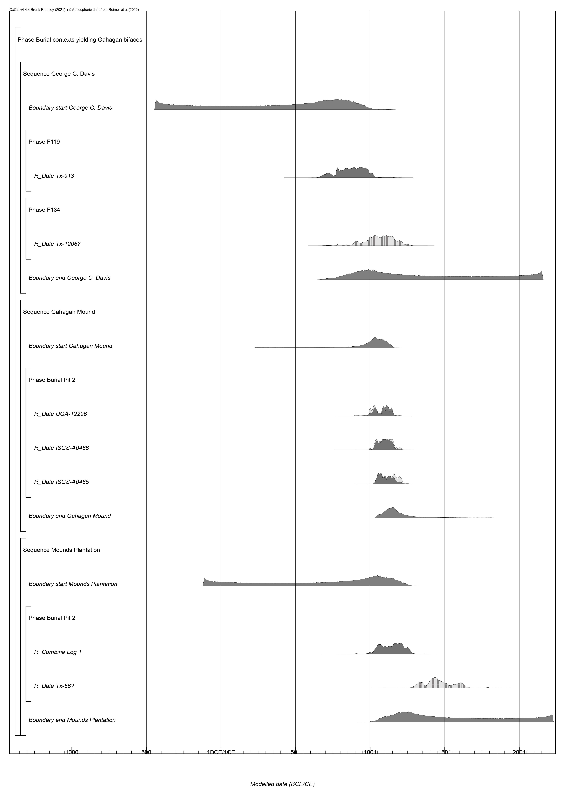

# Temporal Dynamics

Further information regarding the radiocarbon dates discussed below can be found in the text of the previous article [@RN21001]. A table of associated diagnostic artifacts is included as a means of providing information related to relative dates.

```{r install, echo = TRUE}
devtools::install_github('ISAAKiel/oxcAAR')
# load oxcAAR and OxCal
library(kableExtra)
library(oxcAAR)
quickSetupOxcal()
```

## Calibration and plots for dates from Burial Pit 5 at the Mounds Plantation site

Three dates (Tx-55, Tx-56, and M-1466) were reported from Burial Pit 5 at the Mounds Plantation site. More information about these dates can be found in the text, and those works cited within the text of the manuscript.

```{r mplcal, echo=TRUE}
moundspl<-data.frame(bp=c(860,900),
                     std=c(120,100),
                     names=c("Tx-55","M-1466")
)
moundsplcal<-oxcalCalibrate(moundspl$bp,moundspl$std,moundspl$names)
moundsplcal
plot(moundsplcal)
calcurve_plot(moundsplcal)
```

## Calibration and plots for dates from Burial Pit 2 at the Gahagan Mound site

Three AMS dates (UGA12296, ISGS A0465, and ISGS A0466) were reported from Burial Pit 2 at the Gahagan Mound site. More information about these dates can be found in the text, and those works cited within the text of the manuscript.

```{r gahagancal, echo=TRUE}
gahagan<-data.frame(bp=c(1000,950,910),
                    std=c(40,40,35),
                    names=c("UGA-12296","ISGS-A0466","ISGS-A0465")
)
gahagancal<-oxcalCalibrate(gahagan$bp,gahagan$std,gahagan$names)
gahagancal
plot(gahagancal)
calcurve_plot(gahagancal)
```

## Calibration and plots for the dates from F119 and F134 at the George C. Davis site

Two dates (Tx-913 and Tx-1206) were reported from Features 119 and 134, respectively. More information about these dates can be found in the text and cited references.

```{r GCDcal, echo=TRUE}
gcd<-data.frame(bp=c(1150,986),
                std=c(80,90),
                names=c("Tx-913","Tx-1206")
)
gcdcal<-oxcalCalibrate(gcd$bp,gcd$std,gcd$names)
gcdcal
plot(gcdcal)
calcurve_plot(gcdcal)
```

## Chronological model for burial contexts yielding Gahagan bifaces

For reasons discussed by Selden and colleagues [-@RN21001], Tx-1206 and Tx-56 are included in the model as outliers. 

```{r chronmod1, echo=TRUE, eval = FALSE}
# chronological model
gahaganmod <- 'Plot()
 {
  Phase("Burial contexts yielding Gahagan bifaces")
  {
   Sequence("George C. Davis")
   {
    Boundary("start George C. Davis");
    Phase("F119")
    {
     R_Date("Tx-913", 1150, 80);
    };
    Phase("F134")
    {
     R_Date("Tx-1206", 986, 90)
     {
      Outlier();
     };
    };
    Boundary("end George C. Davis");
   };
   Sequence("Mounds Plantation")
   {
    Boundary("start Mounds Plantation");
    Phase("Burial Pit 2")
    {
     R_Combine("Log 1")
     {
      R_Date("M-1466", 900, 100);
      R_Date("Tx-55", 860, 120);
     };
     R_Date("Tx-56", 475, 100)
     {
      Outlier();
     };
    };
    Boundary("end Mounds Plantation");
   };
   Sequence("Gahagan Mound")
   {
    Boundary("start Gahagan Mound");
    Phase("Burial Pit 2")
    {
     R_Date("UGA-12296", 1000, 40);
     R_Date("ISGS-A0466", 950, 40);
     R_Date("ISGS-A0465", 910, 35);
    };
    Boundary("end Gahagan Mound");
   };
  };
 };
'
  gahaganmod_results <- executeOxcalScript(gahaganmod) 
  gahaganmod_text <- readOxcalOutput(gahaganmod_results)
  gahaganmod_result_data <- parseOxcalOutput(gahaganmod_text, 
                                             only.R_Date = F)
  str(gahaganmod_result_data)
  print(gahaganmod_result_data)
  plot(gahaganmod_result_data)
  
#plot start/end boundaries for contexts yielding gahagan bifaces
  gahaganmod_result_data %>%
    sapply(function(x) x$type %in% c("Boundary")) %>%
    gahaganmod_result_data[.] %>%
    oxcAAR:::plot.oxcAARCalibratedDatesList()
```

```{r gahagan14cprint, out.width = "100%", dpi = 300, echo=TRUE, warning=FALSE}
# embed image

```
