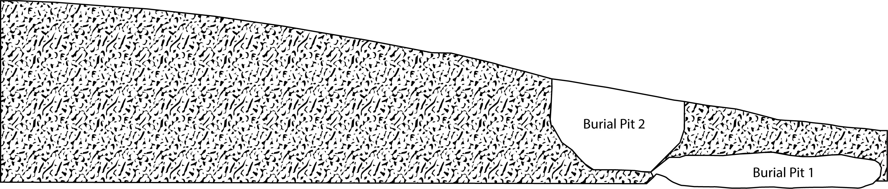
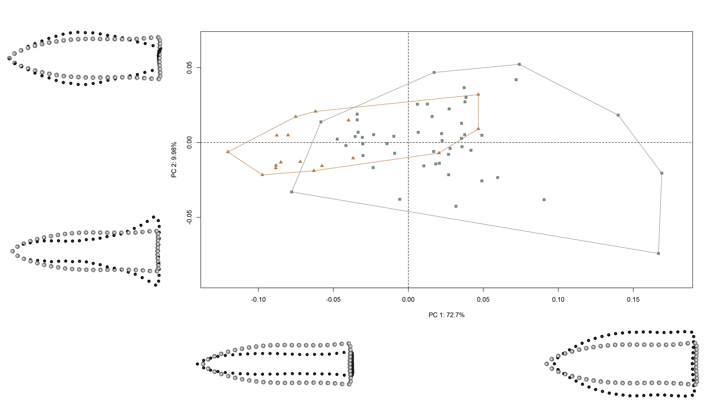

# Hypothesis 1a

This effort follows recent analyses of Gahagan biface shapes across the southern Caddo area and central Texas [@RN11783;@RN21001], where Gahgagan bifaces were found to differ in shape across the same geography as Caddo bottles [@RN11801;@RN11782;@RN11716;@RN8312] and Perdiz arrow points ([Selden and Dockall, in review](https://github.com/seldenlab/perdiz3/blob/main/ms/perdiz3/perdiz3.pdf)). The analysis builds upon previous discussions and analyses conducted by Shafer [-@RN3684;-@RN20701;-@RN4924]. A succinct overview of the analytical procedures used for this analysis is provided in the manuscript, and the analytical code provided in this document can be used to reproduce the results exactly.

## _Hypothesis 1a: Temporal change in preference at Mounds Plantation_

In assessing a temporal change in preference between populations of bifaces from Mounds Plantation, those from burials included during mound development and/or construction (Burial pits 1, 5, and 8) are contrasted with those from Burial pit 2 which cuts into the corner of Burial Pit 1 in Mound 5, cutting downward from the mound's surface. The stratigraphic position of Burial Pit 2 indicates that the burial occurred after those of Burial pits 1, 5, and 8.

```{r h1a.analysis, out.width = "100%", dpi = 300, echo=TRUE, warning=FALSE, fig.cap="Stratigraphic position of Burial Pits 1 and 2 at the Mounds Plantation site; adapted from Webb (1975:Figure 7). Burial Pit 2 is the only burial found to be intrusive from the mound surface."}

```

## Load packages + data

```{r load h1a, setwd, and load data, echo=TRUE, warning=FALSE, eval = FALSE}
# load libraries
library(here)
library(geomorph)
library(tidyverse)
library(wesanderson)

source('readmulti.csv.R')

# read .csv files
setwd("./dataH1a")
filelist <- list.files(pattern = ".csv")
coords <- readmulti.csv(filelist)
setwd("../")

# read qualitative data
qdata <- read.csv("qdataH1a.csv",header = TRUE, row.names = 1)
qdata <- qdata[match(dimnames(coords)[[3]], rownames(qdata)),]
```

## Generalized Procrustes Analysis

Landmark data were aligned to a global coordinate system [@RN11622;@RN11623;@RN11563], achieved through generalized Procrustes superimposition [@RN478] performed in R 4.1.0 [@R] using the `geomorph` library v. 4.0.0 [@RN11530;@RN1774,@RN9565]. Procrustes superimposition translates, scales, and rotates the coordinate data to allow for comparisons among objects [@RN11564;@RN478]. The `geomorph` package uses a partial Procrustes superimposition that projects the aligned specimens into tangent space subsequent to alignment in preparation for the use of multivariate methods that assume linear space [@RN1646;@RN11563]. 

```{r gpa h1a, out.width = "100%", dpi = 300, echo=TRUE, warning=FALSE, eval = FALSE}
Y.gpa <- gpagen(coords, 
              PrinAxes = TRUE, 
              print.progress = FALSE)

## plot gpa
#plot(Y.gpa)

## 3D gpa plot
#knitr::include_graphics('images/m5b2-gpa3d.png')

# geomorph data frame
gdf <- geomorph.data.frame(shape = Y.gpa$coords, 
                         size = Y.gpa$Csize,
                         context = qdata$context) 

# add centroid size to qdata
qdata$csz <- Y.gpa$Csize

# attributes for boxplot
csz <- qdata$csz
context <- qdata$context

# palette
pal <- wes_palette("Moonrise2")
```

## Boxplot

```{r centsize.box.h1a, out.width = "100%", dpi = 300, echo=TRUE, warning=FALSE, eval = FALSE}
# boxplot - centroid size by context
csz.temp <- ggplot(qdata, aes(x = context, y = csz, color = context)) +
  geom_boxplot() +
  geom_dotplot(binaxis = 'y', stackdir = 'center', dotsize = 0.3) +
  scale_color_manual(values = pal) +
  theme(legend.position = "none") +
  labs(x = 'Context', y = 'Centroid Size')

## render plot
csz.temp
```

## Principal Components Analysis

Principal components analysis [@RN1746] was used to visualise shape variation among the bifaces. The shape changes described by each principal axis are commonly visualized using thin-plate spline warping of a reference 3D mesh [@RN1731;@RN479]. 

```{r pcah1a, out.width = "100%", dpi = 300, echo=TRUE, warning=FALSE, eval = FALSE}
# principal components analysis
pca <- gm.prcomp(Y.gpa$coords)
summary(pca)

# set plot parameters to plot by context
pch.gps.context <- c(15,17)[as.factor(context)]
col.gps.context <- pal[as.factor(context)]
col.hull.context <- c("#C27D38","#CCC591")

## plot pca by context 2
pc.plot <- plot(pca, asp = 1,
                  pch = pch.gps.context,
                  col = col.gps.context)
                  shapeHulls(pc.plot, 
                             groups = context,
                             group.cols = col.hull.context)
```

### Plot PCA with mean shape + x/y maxima/minima

```{r pca2.h1a, out.width = "100%", dpi = 300, echo=TRUE, warning=FALSE, eval = FALSE}
## plot PCA with mean shape (gray) and x/y maxima/minima (black)

```

## Procrustes ANOVA

A residual randomization permutation procedure (RRPP; n = 10,000 permutations) was used for all Procrustes ANOVAs [@RN1655;@RN11775], which has higher statistical power and a greater ability to identify patterns in the data should they be present [@RN1719]. To assess whether shape changes with size (allometry), and differs by context (context), Procrustes ANOVAs [@RN1749] were also run that enlist effect-sizes (zscores) computed as standard deviates of the generated sampling distributions [@RN1756]. 

```{r anova.h1a, eval = FALSE}
# MODEL: shape as a function of context
fit.shapecontext <- procD.lm(shape ~ context,
                            data = gdf,
                            print.progress = FALSE,
                            iter = 9999)

# ANOVA: do gahagan biface shapes differ by context?
anova(fit.shapecontext)

# MODEL: size as a function of context
fit.sizecontext <- procD.lm(size ~ context,
                           data = gdf,
                           print.progress = FALSE,
                           iter = 9999)

# ANOVA: do gahagan biface sizes differ by context?
anova(fit.sizecontext)
```

## Mean shapes

```{r m-shapes.h1a, out.width = "100%", dpi = 300, echo=TRUE, warning=FALSE, eval = FALSE}
# subset landmark coordinates to produce mean shapes for contexts
new.coords <- coords.subset(A = Y.gpa$coords,
                            group = qdata$context)

names(new.coords)

## plot shape means
mean <- lapply(new.coords, mshape)
plot(mean$m5)
plot(mean$b2)

# comparison plots
plotRefToTarget(mean$m5,
                mean$b2,
                method = "surface",
                mag = 1)

## 3D plot - final figure
knitr::include_graphics('images/mp-bcontext-figure.png')
```
