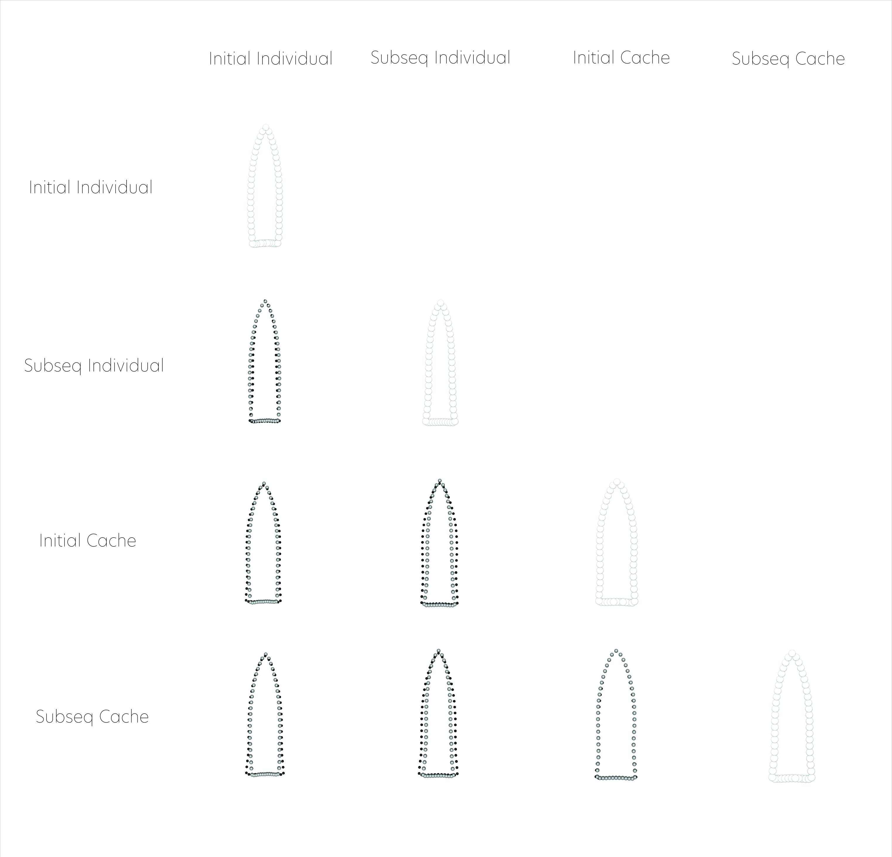

# 3DGM - Temporal

This 3D geometric morphometric analysis follows recent analyses of Gahagan biface morphology across the southern Caddo area and central Texas [@RN11783;@RN21001], where Gahagan bifaces were found to differ in shape across the same geography as Caddo bottles [@RN11801;@RN11782;@RN11716;@RN8312] and Perdiz arrow points ([Selden and Dockall, this volume](https://github.com/seldenlab/perdiz3/blob/main/ms/perdiz3/perdiz3.pdf)). The analysis, and the two that precede it, builds upon the work of Shafer [-@RN3684;-@RN20701;-@RN4924]. A succinct overview of the analytical procedures used for this analysis is provided in the manuscript, and the analytical code provided in this document can be used to reproduce the results exactly.

_**Hypothesis: Gahagan bifaces from individual and cache contexts differ through time as assemblage diversity increases.**_

Distinct Caddo burial practices may have been constrained by local morphological requirements, highlighting aspects of differential `shape preference` as the diversity of Caddo mortuary assemblages increased. The analysis employs _four discrete categories_ to assess morphological changes through time:

-   **Initial Individual**: from initial burial contexts that included Gahagan bifaces at each site, and interred atop or alongside an individual
-   **Initial Cache**: from initial burial contexts that included Gahagan bifaces at each site, and interred as part of a cache along the northern wall of the burial feature
-   **Subsequent Individual**: from subsequent burial contexts that included Gahagan bifaces at each site, and interred atop or alongside an individual
-   **Subsequent Cache**: from subsequent burial contexts that included Gahagan bifaces at each site, and interred as part of a cache along the northern wall of the burial feature

## Load packages + data

```{r load geomorph.div, setwd, and load data, echo=TRUE, warning=FALSE}
# load libraries
library(here)
library(geomorph)
library(tidyr)
library(ggplot2)
library(wesanderson)

source('readmulti.csv.R')

# read .csv files
setwd("./data")
filelist <- list.files(pattern = ".csv")
coords <- readmulti.csv(filelist)
setwd("../")

# read qualitative data
qdata <- read.csv("qdata.csv", header = TRUE, row.names = 1)
qdata <- qdata[match(dimnames(coords)[[3]], rownames(qdata)),]

qdata <- qdata %>% 
  unite("merged", t.context:context, remove = FALSE)
```

## Generalized Procrustes Analysis

Landmark data were aligned to a global coordinate system [@RN11622;@RN11623;@RN11563], achieved through generalized Procrustes superimposition [@RN478] performed in R 4.1.0 [@R] using the `geomorph` library v. 4.0.0 [@RN11530;@RN1774;@RN9565]. Procrustes superimposition translates, scales, and rotates the coordinate data to allow for comparisons among objects [@RN11564;@RN478]. The `geomorph` package uses a partial Procrustes superimposition that projects the aligned specimens into tangent space subsequent to alignment in preparation for the use of multivariate methods that assume linear space [@RN1646;@RN11563]. 

```{r gpa.div, out.width = "100%", dpi = 300, echo=TRUE, warning=FALSE}
Y.gpa <- gpagen(coords,
                PrinAxes = TRUE,
                print.progress = FALSE)
## plot gpa
plot(Y.gpa)

## 3D gpa plot
knitr::include_graphics('images/gpa3d.png')

# geomorph data frame
gdf <- geomorph.data.frame(shape = Y.gpa$coords,
                           size = Y.gpa$Csize,
                           merged = qdata$merged) 

# add centroid size to qdata
qdata$csz <- Y.gpa$Csize

# attributes for boxplot
csz <- qdata$csz
merged <- qdata$merged

# palette
pal <- wes_palette("Moonrise2", 4, type = "continuous")
```

## Boxplot

```{r centsize.box.div, out.width = "100%", dpi = 300, echo=TRUE, warning=FALSE}
# boxplot - centroid size by context
csz.temp <- ggplot(qdata, aes(x = merged, y = csz, color = merged)) +
  geom_boxplot() +
  geom_dotplot(binaxis = 'y', stackdir = 'center', dotsize = 0.3) +
  scale_color_manual(values = pal) +
  theme(legend.position = "none") +
  labs(x = 'Context', y = 'Centroid Size')

## render plot
csz.temp
```

## Principal Components Analysis

Principal components analysis [@RN1746] was used to visualise shape variation among the bifaces. The shape changes described by each principal axis are commonly visualized using thin-plate spline warping of a reference 3D mesh [@RN1731;@RN479]. 

```{r pca1.div, out.width = "100%", dpi = 300, echo=TRUE, warning=FALSE}
# principal components analysis
pca <- gm.prcomp(Y.gpa$coords)
summary(pca)

# set plot parameters to plot by context
pch.gps.context <- c(15:18)[as.factor(merged)]
col.gps.context <- pal[as.factor(merged)]
col.hull.context <- c("#C27D38","#29211F","#798E87","#CCC591")

## plot pca by context 2
pc.plot <- plot(pca, asp = 1,
                pch = pch.gps.context,
                col = col.gps.context)
shapeHulls(pc.plot,
           groups = merged,
           group.cols = col.hull.context)
```

### Plot PCA with mean shape + x/y maxima/minima

```{r pca2.div, out.width = "100%", dpi = 300, echo=TRUE, warning=FALSE}
## plot PCA with mean shape (gray) and x/y maxima/minima (black)
knitr::include_graphics('images/temporal-pca-warpref.png')
```

## Procrustes ANOVA

A residual randomization permutation procedure (RRPP; n = 10,000 permutations) was used for all Procrustes ANOVAs [@RN1655;@RN11775], which has higher statistical power and a greater ability to identify patterns in the data should they be present [@RN1719]. To assess whether shape changes with size (allometry), and differs by context (context), Procrustes ANOVAs [@RN1749] were also run that enlist effect-sizes (zscores) computed as standard deviates of the generated sampling distributions [@RN1756]. 

```{r define-models.div}
# MODEL: shape as a function of context + time
fit.shapecontemp <- procD.lm(shape ~ merged,
                             data = gdf,
                             print.progress = FALSE,
                             iter = 9999)

# ANOVA: do gahagan biface shapes differ by context + time?
anova(fit.shapecontemp)

# pairwise comparison of LS means = which differ?
pairwise.shapecontemp <- pairwise(fit.shapecontemp,
                                  groups = qdata$merged)
summary(pairwise.shapecontemp, 
        confidence = 0.95, 
        test.type = "dist")

# MODEL: size as a function of context + time
fit.sizecontemp <- procD.lm(size ~ merged,
                            data = gdf,
                            print.progress = FALSE,
                            iter = 9999)

# ANOVA: do gahagan biface sizes differ by context + time?
anova(fit.sizecontemp)

# pairwise comparison of LS means = which differ?
pairwise.sizecontemp <- pairwise(fit.sizecontemp,
                                 groups = qdata$merged)
summary(pairwise.sizecontemp, 
        confidence = 0.95, 
        test.type = "dist")
```

## Morphological disparity

```{r m-disparity}
# morphological disparity by shape
morphol.disparity(fit.shapecontemp, 
                  groups = qdata$merged, 
                  data = gdf, 
                  print.progress = FALSE, 
                  iter = 9999)

# morphological disparity by size
morphol.disparity(fit.sizecontemp, 
                  groups = qdata$merged, 
                  data = gdf, 
                  print.progress = FALSE, 
                  iter = 9999)
```

## Mean shapes

```{r m-shapes.div, out.width = "100%", dpi = 300, echo=TRUE, warning=FALSE}
# subset landmark coordinates to produce mean shapes for contexts
new.coords <- coords.subset(A = Y.gpa$coords,
                            group = qdata$merged)

names(new.coords)

## plot shape means
mean <- lapply(new.coords, mshape)
plot(mean$initial_cache)
plot(mean$initial_individual)
plot(mean$subsequent_cache)
plot(mean$subsequent_individual)

# comparison plots
plotRefToTarget(mean$initial_individual,
                mean$initial_cache, 
                method = "points",
                mag = 1)

plotRefToTarget(mean$initial_individual,
                mean$subsequent_individual, 
                method = "points",
                mag = 1)

plotRefToTarget(mean$initial_individual,
                mean$subsequent_cache, 
                method = "points",
                mag = 1)

plotRefToTarget(mean$initial_cache,
                mean$subsequent_individual, 
                method = "points",
                mag = 1)

plotRefToTarget(mean$subsequent_individual,
                mean$initial_cache, 
                method = "points",
                mag = 1)

plotRefToTarget(mean$initial_cache,
                mean$subsequent_cache, 
                method = "points",
                mag = 1)

## 3D plot - final figure

```
