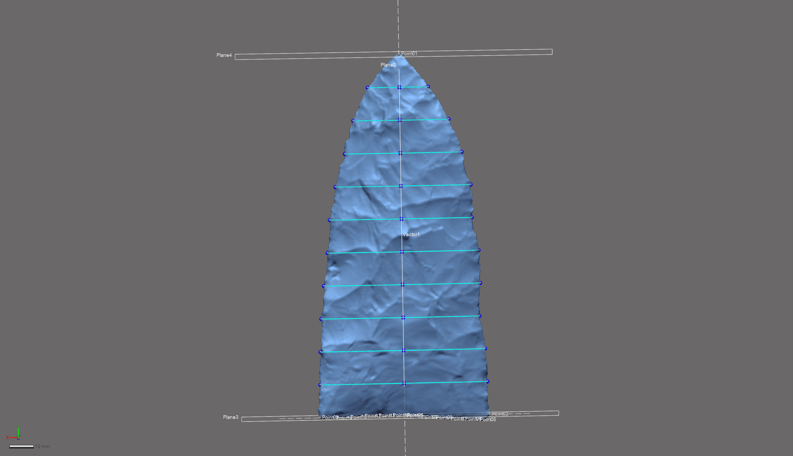
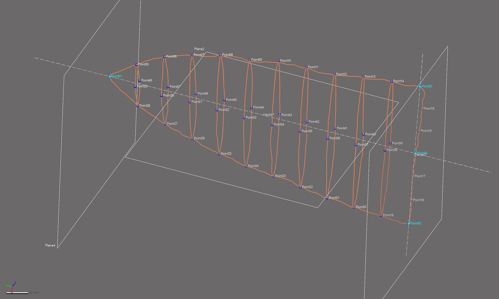

--- 
title: "Supplementary materials for article: Morphological trajectories of Gahagan bifaces from Caddo burial contexts"
author: 
    - Robert Z. Selden, Jr.^[Heritage Research Center, Stephen F. Austin State University; Department of Biology, Stephen F. Austin State University; and Cultural Heritage Department, Jean Monnet University, zselden@sfasu.edu], John E. Dockall^[Cox|McClain Environmental Consulting, Inc.], Christian S. Hoggard^[Department of Archaeology, University of Southampton], and David K. Thulman^[Department of Anthropology, George Washington University]
date: "`r Sys.Date()`"
site: bookdown::bookdown_site
documentclass: book
bibliography: [book.bib]
biblio-style: apalike
link-citations: yes
description: "Gahagan biface shape change."
---

# Preface {-}

>Reproducibility---the ability to recompute results---and replicability---the chances other experimenters will achieve a consistent result---are two foundational characteristics of successful scientific research [@RN20918].

## Basis of inquiry

Gahagan bifaces represent one of three categories of Caddo material culture that express a significant differences in morphology across the same geography as Caddo bottles and Perdiz arrow points [@RN11783;@RN11801;@RN11782;@RN11716;@RN8312]. The morphology of Gahagan bifaces from sites in central Texas was also found to differ significantly when compared with those recovered from the ancestral Caddo area [@RN21001]. That Gahagan bifaces have been found to differ across two spatial boundaries was noteworthy, particularly since it is regularly assumed that they were manufactured in central Texas and arrived in the ancestral Caddo area as products of trade or exchange [@RN11783;@RN21001]. Further, that Gahagan bifaces were found to differ across the same geographic area as Caddo bottles suggested that the temporal range of the _shape boundary_ might extend to the Formative/Early Caddo period (CE 800 - 1250); a notion that was later confirmed in a more comprehensive analysis of Caddo bottles [@RN8312].

This study shifts the analytical foci of the research program from one of regional trends to one of local Caddo burial contexts.

```{r gahagan bifaces 2D, out.width = "100%", dpi = 300, echo=TRUE, warning=FALSE, fig.cap="Gahagan bifaces from the northern and southern Caddo behavioral regions. Bifaces recovered with an individual denoted by black circles. Additional information for each bifaces, including the option to download 2D images of these bifaces, can be found at [https://scholarworks.sfasu.edu/ita-gahaganbiface/](https://scholarworks.sfasu.edu/ita-gahaganbiface/)."}
knitr::include_graphics('images/fig02.jpg')
```

## Primary findings

### Temporal change in preference

**Hypothesis 1: Gahagan bifaces selected for inclusion in Caddo burials differ in morphology through time.**

Hypothesis 1 is tested using two samples of Gahagan bifaces from Caddo burial contexts from the Mounds Plantation and George C. Davis sites where stratigraphy dictates differing temporal positions. The information gathered from the analysis provides valuable insights with regard to _design intent_ (for central Texas makers) and aesthetic preference (for Caddo users) that articulate with Gahagan bifaces at different temporal intervals.

#### _Hypothesis 1a: Temporal change in preference at Mounds Plantation_

In assessing a temporal change in preference between populations of bifaces from Mounds Plantation, those from burials included during mound development and/or construction (Burial pits 1, 5, and 8) are contrasted with those from Burial pit 2 which cuts into the corner of Burial Pit 1 in Mound 5, cutting downward from the mound's surface. The stratigraphic position of Burial Pit 2 indicates that the burial occurred after those associated with Burial Pits 1, 5, and 8.

```{r h1a, out.width = "100%", dpi = 300, echo=TRUE, warning=FALSE, fig.cap="Stratigraphic position of Burial Pits 1 and 2 at the Mounds Plantation site; adapted from Webb (1975:Figure 7). Burial Pit 2 is the only burial found to be intrusive from the mound surface."}
knitr::include_graphics('images/h1a.jpg')
```

##### _Hypothesis 1a Findings_:

#### _Hypothesis 1b: Temporal change in preference at George C. Davis_

To assess the temporal change in preference between populations of bifaces from George C. Davis, those recovered from Feature 134 are contrasted with those from Feature 119. The stratigraphic position of Feature 119 indicates that the burials in that feature occurred after those associated with Feature 134.

```{r h1b, out.width = "100%", dpi = 300, echo=TRUE, warning=FALSE, fig.cap="Stratigraphic position of Features 119 and 134 at the George C. Davis site; adapted from Story (1997:Figure 13)."}
knitr::include_graphics('images/h1b.jpg')
```

##### _Hypothesis 1b Findings_:

### General morphological trajectory

**Hypothesis 2: Gahagan bifaces included in Caddo burials as a cache offering differ in morphology from those placed with an individual.**

Hypothesis 2 is tested using a sample of Gahagan bifaces interred as part of a Caddo group offering (henceforth called a cache) or with a Caddo individual. Findings provide useful insights with regard to macro trends associated with the use-life of Gahagan bifaces, which may have ranged from a cache offering (where _design intent_ is assumed) to an individual offering (where minor modification(s)/retouch may be present).

#### _Hypothesis 2 Findings_:

## Acknowledgments

We extend our gratitude to the Caddo Nation of Oklahoma, the Williamson Museum at Northwestern State University, the Louisiana State Exhibit Museum, the Texas Archeological Research Laboratory at The University of Texas at Austin, the Brazos Valley Museum of Natural History, the Texas Parks and Wildlife Department, and the Sam Noble Oklahoma Museum of Natural Science for the requisite permissions and access needed to generate the 3D scans of the Gahagan bifaces. Thanks to Harry J. Shafer, Hiram F. (Pete) Gregory, Christian S. Hoggard, and David K. Thulman for their comments on the analyses of Gahagan biface shape. Thanks to Martin Hinz for fielding questions related to the oxcAAR package, and to Derek Hamilton for his guidance with the chronological models, and to Dean C. Adams, Michael L. Collyer, Emma Sherratt, Lauren Butaric, and Kersten Bergstrom for their constructive criticisms, general comments, and suggestions throughout the development of this research program.

## Funding

Components of this analytical work flow were developed and funded by a Preservation Technology and Training grant (P14AP00138) to RZS from the National Center for Preservation Technology and Training (NCPTT), and additional grants to RZS from the Caddo Tribe of Oklahoma, National Forests and Grasslands in Texas (15-PA-11081300-033) and the United States Forest Service (20-PA-11081300-074). Funding to scan the Gahagan bifaces at the Williamson Museum at Northwestern State University, Louisiana State Exhibit Museum, Texas Archeological Research Laboratory at The University of Texas at Austin, and Sam Noble Oklahoma Museum of Natural Science was provided to the RZS by the Heritage Research Center at Stephen F. Austin State University.

## Data management

This volume is written in _Markdown_, and all files needed to reproduce the analytical findings are included in the [GitHub repository](https://github.com/aksel-blaise/gahaganmorph3), which is digitally curated on the Open Science Framework. The reproducible nature of this undertaking provides a means for others to critically assess and evaluate the various analytical components [@RN20915;@RN20916;@RN20917], which is a necessary requirement for the production of reliable knowledge.

Reproducibility projects in [psychology](https://osf.io/ezcuj/) and [cancer biology](https://www.cos.io/rpcb) are impacting current research practices across all domains. Examples of reproducible research are becoming more abundant in archaeology [@RN20804;@RN21009;@RN11783;@RN21001], and the next generation of archaeologists are learning those tools and methods needed to reproduce and/or replicate research results [@RN21007]. Reproducible and replicable research work flows are often employed at the highest levels of humanities-based inquiries to mitigate concern or doubt regarding proper execution, and is of particular import should the results have---explicitly or implicitly---a major impact on scientific progress [@RN21008].

The analysis code associated with this project can be accessed through this document or the [GitHub](https://github.com/seldenlab/gahaganmorph.3) repository, which is digitally curated on the Open Science Framework [DOI: 10.17605/OSF.IO/JV3X8](https://osf.io/jv3x8/).

## Colophon

This version of the analysis was generated on `r Sys.time()` using the following computational environment and dependencies: 

```{r colophon, cache = FALSE}
# which R packages and versions were used?
if ("devtools" %in% installed.packages()) devtools::session_info()
```

Current Git commit details are:

```{r}
# where can I find this commit? 
if ("git2r" %in% installed.packages() & git2r::in_repository(path = ".")) git2r::repository(here::here())  
```

<!--chapter:end:index.Rmd-->

# Temporal Dynamics

Further information regarding the radiocarbon dates discussed below can be found in the text of the previous article [@RN21001].

```{r install, echo = TRUE}
devtools::install_github('ISAAKiel/oxcAAR')
# load oxcAAR and OxCal
library(oxcAAR)
quickSetupOxcal()
```

## Calibration and plots for dates from Burial Pit 5 at the Mounds Plantation site

Three dates (Tx-55, Tx-56, and M-1466) were reported from Burial Pit 5 at the Mounds Plantation site. More information about these dates can be found in the text, and those works cited within the text of the manuscript.

```{r mplcal, echo=TRUE}
moundspl<-data.frame(bp=c(860,900),
                     std=c(120,100),
                     names=c("Tx-55","M-1466")
)
moundsplcal<-oxcalCalibrate(moundspl$bp,moundspl$std,moundspl$names)
moundsplcal
plot(moundsplcal)
calcurve_plot(moundsplcal)
```

## Calibration and plots for dates from Burial Pit 2 at the Gahagan Mound site

Three AMS dates (UGA12296, ISGS A0465, and ISGS A0466) were reported from Burial Pit 2 at the Gahagan Mound site. More information about these dates can be found in the text, and those works cited within the text of the manuscript.

```{r gahagancal, echo=TRUE}
gahagan<-data.frame(bp=c(1000,950,910),
                    std=c(40,40,35),
                    names=c("UGA-12296","ISGS-A0466","ISGS-A0465")
)
gahagancal<-oxcalCalibrate(gahagan$bp,gahagan$std,gahagan$names)
gahagancal
plot(gahagancal)
calcurve_plot(gahagancal)
```

## Calibration and plots for the dates from F119 and F134 at the George C. Davis site

Two dates (Tx-913 and Tx-1206) were reported from Features 119 and 134, respectively. More information about these dates can be found in the text and cited references.

```{r GCDcal, echo=TRUE}
gcd<-data.frame(bp=c(1150,986),
                std=c(80,90),
                names=c("Tx-913","Tx-1206")
)
gcdcal<-oxcalCalibrate(gcd$bp,gcd$std,gcd$names)
gcdcal
plot(gcdcal)
calcurve_plot(gcdcal)
```

## Chronological model for burial contexts yielding Gahagan bifaces

For reasons discussed by Selden and colleagues [-@RN21001], Tx-1206 and Tx-56 are included in the model as outliers. 

```{r chronmod1, echo=TRUE, eval = FALSE}
# chronological model
gahaganmod <- 'Plot()
 {
  Phase("Burial contexts yielding Gahagan bifaces")
  {
   Sequence("George C. Davis")
   {
    Boundary("start George C. Davis");
    Phase("F119")
    {
     R_Date("Tx-913", 1150, 80);
    };
    Phase("F134")
    {
     R_Date("Tx-1206", 986, 90)
     {
      Outlier();
     };
    };
    Boundary("end George C. Davis");
   };
   Sequence("Mounds Plantation")
   {
    Boundary("start Mounds Plantation");
    Phase("Burial Pit 2")
    {
     R_Combine("Log 1")
     {
      R_Date("M-1466", 900, 100);
      R_Date("Tx-55", 860, 120);
     };
     R_Date("Tx-56", 475, 100)
     {
      Outlier();
     };
    };
    Boundary("end Mounds Plantation");
   };
   Sequence("Gahagan Mound")
   {
    Boundary("start Gahagan Mound");
    Phase("Burial Pit 2")
    {
     R_Date("UGA-12296", 1000, 40);
     R_Date("ISGS-A0466", 950, 40);
     R_Date("ISGS-A0465", 910, 35);
    };
    Boundary("end Gahagan Mound");
   };
  };
 };
'
  gahaganmod_results <- executeOxcalScript(gahaganmod) 
  gahaganmod_text <- readOxcalOutput(gahaganmod_results)
  gahaganmod_result_data <- parseOxcalOutput(gahaganmod_text, 
                                             only.R_Date = F)
  str(gahaganmod_result_data)
  print(gahaganmod_result_data)
  plot(gahaganmod_result_data)
  
#plot start/end boundaries for contexts yielding gahagan bifaces
  gahaganmod_result_data %>%
    sapply(function(x) x$type %in% c("Boundary")) %>%
    gahaganmod_result_data[.] %>%
    oxcAAR:::plot.oxcAARCalibratedDatesList()
```

```{r gahagan14cprint, out.width = "100%", dpi = 300, echo=TRUE, warning=FALSE}
# embed image
knitr::include_graphics('images/gahagan-14cmodel.png')
```

<!--chapter:end:01-gahagan14c.Rmd-->

# Modeling Geometry

Two Gahagan bifaces, both from the George C. Davis site (4078-8, and 4078-72), were missing small sections of the blade along the lateral edge. This analysis limited the inclusion of specimens with missing data to those where the area of missing data was smaller than a dime (10-cent coin in the US), ensuring that modeling was kept to a minimum.

Modeling was completed in _Geomagic Design X (Build Version 2019.0.2 [Build Number: 78])_. Modeling occurred in advance of the `auto3dgm` alignment. Following alignment, these two specimens were landmarked following the same landmarking protocol as the unmodeled bifaces.

In both cases, the area of highest concern was that of the lateral edge. To ensure that the fit followed the existing contour, the area was first cut and cleaned, then bridges were constructed that enlisted variable curvature, following with the existing curvature of the edge. Once fitted with the bridge, the remaining holes on either side were filled following those protocols set forth in [@RN11521].

The images that follow include a before and after modeling image of each biface, illustrating the area of the biface that was missing, and the subsequent model that was used in the geometric morphometric analysis. In the case of 4078-8, one semilandmark was included in the modeled area. No semilandmarks were placed in the modeled area of 4078-72.

## 4078-8

```{r fig4078-8-init, out.width = "100%", dpi = 300, echo=TRUE, warning=FALSE, fig.cap="Gahagan biface 4078-8, before modeling."}
knitr::include_graphics('images/41ce19-4078-8-unmodeled.png')
```

```{r fig4078-8-mod, out.width = "100%", dpi = 300, echo=TRUE, warning=FALSE, fig.cap="Gahagan biface 4078-8, after modeling."}

```

## 4078-72

```{r fig4078-72-init, out.width = "100%", dpi = 300, echo=TRUE, warning=FALSE, fig.cap="Gahagan biface 4078-72, before modeling."}
knitr::include_graphics('images/41ce19-4078-72-unmodeled.png')
```

```{r fig4078-72-mod, out.width = "100%", dpi = 300, echo=TRUE, warning=FALSE, fig.cap="Gahagan biface 4078-72, after modeling."}
knitr::include_graphics('images/41ce19-4078-72-modeled.png')
```

<!--chapter:end:02-modeling-geometry.Rmd-->

# Landmarking Protocol 3d2

The landmarking protocol (LM3d2) developed for this project represents a substantial methodological advancement when contrasted with those protocols used in previous studies of Gahagan biface morphology [@RN11783;@RN21001]. This protocol represents the continued evolution of a research programme concerned with the development of a rigorous and replicable three-dimensional (3D) landmarking workflow, which simultaneously takes into account the unique and complex design elements associated with individual bifaces. Landmark (LM) and semilandmark (sLM) placement was achieved through the construction of reference geometry in _Geomagic Design X (Build Version 2020.0.2 [Build Number: 55])_, used to expand upon the previous LM configuration, and capitalise upon additional design attributes. Reference geometry provides the requisite foundation needed to apply the LM and sLM points at mathematically-defined locations. The result is a LM and sLM configuration that articulates with specific morphological features (plan views, profiles, and cross-sections), which have demonstrated utility in wide-ranging studies of biface and projectile point morphology.

## Foundations

The initial landmarking protocol enlisted a curve that was projected onto a 2D plane. That protocol provided the framework needed to begin a more thorough consideration of 3D landmarking protocols, driving the evolution of the landmarking protocol described here.

```{r fig.gahaganmorph, fig.cap="The landmarking protocol used in the 2D analysis of Gahagan bifaces, where all landmarks and semilandmarks were projected onto a plane."}
knitr::include_graphics('images/gahaganmorph.jpg')
```

The first 3D landmarking protocol ([LM3d1](https://github.com/aksel-blaise/gahaganmorph2/blob/master/analysis/landmarking-protocol.md)) used for an analysis of Gahagan bifaces focused only upon the plan view (lateral/basal edges), and enlisted _auto3dgm_ to achieve the principal alignments needed to assign the front and back to each face. While basic, this landmarking protocol generated the requisite framework needed to begin constructing different suites of design-driven `reference geometry` that can be tailored to address specific research questions.

```{r fig.gahaganmorph2, fig.cap="The first [3D landmarking protocol](https://github.com/aksel-blaise/gahaganmorph2/blob/master/analysis/landmarking-protocol.md) (LM3d1) used to analyse Gahagan bifaces, which captured those attributes associated with axial twisting."}
knitr::include_graphics('images/gahaganmorph2.png')
```

The goal of this effort was to increase the precision and rigour of the study by including additional elements from the Z-dimension to capture morphological characteristics associated with plan, profile, and cross-sections. This landmarking protocol is the culmination of the iterative design process that began during the previous 2D [@RN11783] and 3D ([LM3d1](https://github.com/aksel-blaise/gahaganmorph2/blob/master/analysis/landmarking-protocol.md)) [@RN21001] geometric morphometric analyses, and includes fewer steps than [LM3d3](https://aksel-blaise.github.io/dalton/landmarking-protocol-3d3.html). The cross-sections increase the coverage of sLMs across mesh topology, providing for greater precision in the analysis of whole-object morphology, and can be subset as a means of analyzing specific features of interest. For this study, the previously-noted morphological differences that occur in plan view [@RN11783;@RN21001] are further scrutinized in an effort to explore whether those differences in Gahagan biface plan view might be said to extend to the profiles of Gahagan bifaces. Due to the degree of axial twisting that occurs across the sample, it is not possible to gather the data needed to answer this query using 2D methods.

The continued evolution of this landmarking protocol represents a concerted effort to better comprehend the vagaries of morphological similarities and differences among Gahagan bifaces. While true that some landmarking protocols can be---and often are---recycled as new specimens are added, this research program endeavors to achieve ever-greater accuracy and precision in each subsequent iteration.

## Generating the peripheral (plan view) spline

This effort begins with a spline extracted from the surface geometry of the mesh using the `extract contour curves` command. In reverse-engineering, `extract contour curves` is regularly employed as the first step in building a `patch network` to construct a surface. The extracted feature curve is rendered as a spline, and follows the highest curvature contours around the periphery of the lateral and basal edges, following the highly variable sinuous edge morphology around the entirety of each biface [@RN21001]. The remainder of the landmarking protocol is based upon this spline, which was subsequently split at four mathematically-defined locations [@RN21001].

```{r figspline, out.width = "100%", dpi = 300, echo=TRUE, warning=FALSE, fig.cap="Spline extracted along the highest contours of the projectile."}
knitr::include_graphics('images/extractspline.png')
```

### Splitting Spline 1

_`Reference geometries` are used in the assistance of creating other features. These include basic geometric entities, such as `planes`, `vectors`, `coordinates`, `points`, and `polygons`. A `reference point` is a virtual point and is used to mark a specific position on a model or in 3D space. A `reference plane` is a virtual plane that has a normal direction and an infinite size. A `reference plane` is not a surface body, and is used to create other features._ 

The characteristic points and tangents developed for this landmarking protocol were inspired by the work of Birkhoff [-@RN11786], and have been gainfully employed within the context of both ceramic [@RN11801;@RN11782;@RN11716;@RN20852] and lithic analyses [@RN11783;@RN21001]. 

#### Split Spline 1 at location of LM 01

The `horizontal tangent` was calculated by drawing a horizontal line above the tip of each biface using the tangent as a `common constraint`, and the `horizontal` as the `independent constraint`. To split the 3D spline at the location of the `horizontal tangent`, a `reference point` was inserted at the location of the `tangent` in the 2D sketch (light blue point; below, left), followed by a `reference plane` (in white; below, left and right) using the `pick point and normal axis` function where the `reference point` (h-tangent) was used as the `pick point`, and the `Right plane` as the `normal axis` (below, left). The 3D spline was cut at the location where the `reference plane` intersected with the spline (below image, right).

```{r figlm1, out.width = "100%", dpi = 300, echo=TRUE, warning=FALSE, fig.cap="Identify horizontal tangent, insert reference point and reference plane (left). Use reference plane to cut spline at the location of the horizontal tangent (right)."}
knitr::include_graphics('images/lm1.png')
```

#### Split Spline 1 at locations of LM 02 and LM 03

The point of highest curvature on either side of the basal edge was calculated using the `curvature` function in the Accuracy Analyzer. This function displays the curvature flow as a continuous color plot across the area of the curve. In this instance, _curvature_ is defined as the amount by which a geometric shape deviates from being flat or straight in the case of a line. Curvature is displayed in different colors according to the local radius, and calculated in only one direction (U or V) along the curve. Using this tool, the two points of highest curvature were located between the basal and lateral edges on either side of each projectile where the local radius measure was largest. The orientation of each biface was initially dictated by the _auto3dgm_ alignment in [LM3d1](https://github.com/aksel-blaise/gahaganmorph2/blob/master/analysis/landmarking-protocol.md); however, _LM3d2 follows a different protocol._

```{r figcurve, out.width = "100%", dpi = 300, echo=TRUE, warning=FALSE, fig.cap="Identify points of hightest curvature (light blue) at left/right intersection of lateral and basal edges."}
knitr::include_graphics('images/splinesplit1.png')
```

#### Split Spline 1 at location of LM 04

One additional landmark (LM 06) was placed at the center of the base. The location of this landmark was identified by calculating the linear distance between LM 02 and LM 03, and projecting a `reference point` (ctrl-div; below) equidistant between the two. A `reference plane` was added using the ctrl-div as the pick point, and the `Right plane` as the `normal axis`. The spline was then split at the intersection of the `reference plane` and the basal spline.

```{r figlm4, out.width = "100%", dpi = 300, echo=TRUE, warning=FALSE, fig.cap="Calculate linear distance between LM2 and LM3, insert reference plane coplanar to Right plane equidistant between LM2 and LM3, and use the reference plane to cut the spline."}
knitr::include_graphics('images/lm4.png')
```

## Reference geometry, Build 1

Each of the preceding protocols were used in the previous analysis of Gahagan bifaces [@RN21001], and the following sections detail the evolution of that landmarking protocol. The resulting constellation of LM and sLM points can be subset to test a wide range of hypotheses associated with the plan and profile views of bifaces, and can be extended to include specific or multiple components of each cross-section. Each cross-section is also split between LM 01 and LM04, allowing for analyses of _bilateral asymmetry_ for both plan and profile views.

### Reference Vector 1, Point 2, and Plane 2

A linear `reference vector` (vector.1) was inserted between LM 01 and LM 04, and a `reference point` (ref.pt.2) was placed equidistant between LMs 02 and 03 along vector.1. The Z-coordinates of ref.pt.2 were altered to relocate it 15mm from vector.1 in the direction of the Z-axis, while otherwise maintaining its' alignment with vector 1. The `pick point and coplanar` function was used to place a `reference plane` (ref.pl.2) along vector.1 in the direction of ref.pt.2, bisecting the biface along the Z-axis---perpendicular to the lateral edges---between LM 01 and LM 04.

```{r vecptplane, out.width = "100%", dpi = 300, echo=TRUE, warning=FALSE, fig.cap="Vector.1 placed between LM 01 and 04, ref.pt.2 equidistant between the landmarks along vector.1. Z-coordinates altered to offset the point 15mm from vector.1 (left two images). Vector.1 and ref.pt.2 were used to place a ref.pl.2 coplanar to the vector in the direction of ref.pt.2 using the `pick point and coplanar axis` function (right two images)."}
knitr::include_graphics('images/vecptplane.png')
```

### Reference Planes 3 and 4

Using the same method, a `reference vector` (vector.2) was inserted between LM 02 and LM 03 using the same `reference point`. The Z-coordinates of ref.pt.3 were similarly altered to relocate it 15 mm from vector.2 in the direction of the Z-axis. The `pick point and coplanar axis` function was used to place a `reference plane` ref.pl.3 along vector.2 in the direction of ref.pt.3, bisecting the biface along the X-axis---parallel to the base---between LM 02 and LM 03. A fourth `reference plane` ref.pl.4 was inserted using the `pick point and normal axis` function, placing a plane at the intersection of LM 01 and vector.1. These two planes serve as the basis for the equidistant cross-sections. 

_**The angle between the ref.pl.2 and ref.pl.3 was measured on each side of ref.pl.2, and the side with the lowest angle was kept on the right during the remainder of the landmarking process. LMs 02 and 03 were assigned following this calculation.**_

```{r plane3.4, out.width = "100%", dpi = 300, echo=TRUE, warning=FALSE, fig.cap="Vector placed between LM 01 and 04, ref.pt.2 equidistant between the landmarks along the vector, then the Z-coordinates were altered to offset the point 15mm from the vector (left two images). The vector and ref.pt.3 were subsequently used to place a plane coplanar to the vector in the direction of ref.pt.3 using the `pick point and coplanar axis` function. Plane 4 was inserted using the `pick point and normal axis` function with vector1 as the normal axis, and LM 01 as the pick point."}
knitr::include_graphics('images/plane3-4.png')
```

## Cross-sections

Twelve equidistant curves were inserted between the ref.pl.3 and ref.pl.4 using the `section` function, and those that bisected the biface at the location of LM 01 and LM 04 were deleted. The resulting 10 curves were split at the points of highest curvature along the lateral edges, then along the mid-line at the point where they intersect with ref.pl.2.

```{r cross.10, out.width = "100%", dpi = 300, echo=TRUE, warning=FALSE, fig.cap="Ten equidistant cross-sections were inserted between Plane 3 and Plane 4."}
knitr::include_graphics('images/cross.10.png')
```

### Splitting the curves (Step 1)

Cross-sections were split at the intersection of each horizontal curve and ref.pl.2. The resulting `reference geometry` provides a means of analysing the contribution of bifacial morphology associated with the projectile's profile, and divides the landmarking configuration into two discrete components (plan and profile view) for use in the analysis.

```{r cut.cross.plane2, out.width = "100%", dpi = 300, echo=TRUE, warning=FALSE, fig.cap="Cross-sections were cut where they intersect with Plane 2, along the mid-line of the projectile between LM 01 and LM 04."}
knitr::include_graphics('images/cut.cross.plane2.png')
```

### Splitting the curves (Step 2)

Each curve was split at the two points of highest curvature along the lateral edges of the biface. These sLMs contribute to the analysis of the projectile in plan view, and follow the dynamic---and unique---3D contours associated with the lateral edge of each biface.

```{r pt.high.curv.split, out.width = "100%", dpi = 300, echo=TRUE, warning=FALSE, fig.cap="Spline splits (blue dots) along the lateral edges occur at the point of highest curvature. These splits occur at known coordinates used to add the semilandmarks."}

```

## Landmark and semilandmark placement

Landmarks were placed at the locations of spline splits following the same protocol enlisted by the previous study (blue points, below) [@RN21001]. Two equidistant sLMs were added between LM 02 and LM 04, and between LM 04 and LM 03. Along the lateral edges, sLMs were numbered from the top right, then from top/front along the mid-line.

```{r figlmslm-all, out.width = "100%", dpi = 300, echo=TRUE, warning=FALSE, fig.cap="Reference geometry and 3D curves with landmarks (blue) and semilandmarks (white) applied."}

```

The resulting constellation of LMs and sLMs can be parsed and divided to answer wide-ranging morphological questions related to Gahagan bifaces, marking a substantive advancement in the analysis of Gahagan biface morphology. The design of the `reference geometry` used in LM3d2 is extensible, and the semilandmark configuration can expanded or contracted as the research programme---and research questions---evolves.

## Acknowledgments

I extend my gratitude to Christian S. Hoggard and David K. Thulman for their thoughtful comments and constructive criticisms on an earlier draft of [LM3d1](https://github.com/aksel-blaise/gahaganmorph2/blob/master/analysis/landmarking-protocol.md), as well as this landmarking protocol. The current iteration of the landmarking protocol was developed using the `digit3DLand` package in R (code available in this repository); however, the capacity to populate a replicable suite of `reference geometry` across the sample in _Geomagic Design X_ provides a means of making this design process extensible.

<!--chapter:end:03-landmarking-protocol.Rmd-->

# Hypothesis 1a

This effort follows recent analyses of Gahagan biface shapes across the southern Caddo area and central Texas [@RN11783;@RN21001], where Gahgagan bifaces were found to differ in shape across the same geography as the Smithport Plain and Hickory Engraved bottles [@RN11801;@RN11782;@RN11716;@RN8312]. The analysis builds upon previous discussions and analyses conducted by Shafer [-@RN3684;-@RN20701;-@RN4924]. A succinct overview of the analytical procedures used for this analysis is provided in the manuscript, and the analytical code provided in this document can be used to reproduce the results exactly.

#### _Hypothesis 1a: Temporal change in preference at Mounds Plantation_

In assessing a temporal change in preference between populations of bifaces from Mounds Plantation, those from burials included during mound development and/or construction (Burial pits 1, 5, and 8) are contrasted with those from Burial pit 2 which cuts into the corner of Burial Pit 1 in Mound 5, cutting downward from the mound's surface. The stratigraphic position of Burial Pit 2 indicates that the burial occurred after those of Burial pits 1, 5, and 8.

## Load packages + data

```{r load h1a, setwd, and load data, echo=TRUE, warning=FALSE, eval = FALSE}
# load libraries
library(here)
library(geomorph)
library(tidyverse)
library(wesanderson)

source('readmulti.csv.R')

# read .csv files
setwd("./dataH1a")
filelist <- list.files(pattern = ".csv")
coords <- readmulti.csv(filelist)
setwd("../")

# read qualitative data
qdata <- read.csv("qdataH1a.csv",header = TRUE, row.names = 1)
qdata <- qdata[match(dimnames(coords)[[3]], rownames(qdata)),]
```

## Generalized Procrustes Analysis

Landmark data were aligned to a global coordinate system [@RN11622;@RN11623;@RN11563], achieved through generalized Procrustes superimposition [@RN478] performed in R 4.1.0 [@R] using the `geomorph` library v. 4.0.0 [@RN11530;@RN1774]. Procrustes superimposition translates, scales, and rotates the coordinate data to allow for comparisons among objects [@RN11564;@RN478]. The `geomorph` package uses a partial Procrustes superimposition that projects the aligned specimens into tangent space subsequent to alignment in preparation for the use of multivariate methods that assume linear space [@RN1646;@RN11563]. 

```{r gpa h1a, out.width = "100%", dpi = 300, echo=TRUE, warning=FALSE, eval = FALSE}
Y.gpa <- gpagen(coords, 
              PrinAxes = TRUE, 
              print.progress = FALSE)
## plot gpa
plot(Y.gpa)

# geomorph data frame
gdf <- geomorph.data.frame(shape = Y.gpa$coords, 
                         size = Y.gpa$Csize,
                         context = qdata$context) 

# add centroid size to qdata
qdata$csz <- Y.gpa$Csize

# boxplot - context by centroid size
csz <- qdata$csz
context <- qdata$context

# palette
pal <- wes_palette("Moonrise2")
```

## Boxplot

```{r centsize.box.h1a, out.width = "100%", dpi = 300, echo=TRUE, warning=FALSE, eval = FALSE}
# boxplot of Perdiz arrow points by context
csz.temp <- ggplot(qdata, aes(x = context, y = csz, color = context)) +
  geom_boxplot() +
  geom_dotplot(binaxis = 'y', stackdir = 'center', dotsize = 0.3) +
  scale_color_manual(values = pal) +
  theme(legend.position = "none") +
  labs(x = 'Context', y = 'Centroid Size')

## render plot
csz.temp
```

## Principal Components Analysis

Principal components analysis [@RN1746] was used to visualise shape variation among the bifaces. The shape changes described by each principal axis are commonly visualized using thin-plate spline warping of a reference 3D mesh [@RN1731;@RN479]. 

```{r pcah1a, out.width = "100%", dpi = 300, echo=TRUE, warning=FALSE, eval = FALSE}
# principal components analysis
pca <- gm.prcomp(Y.gpa$coords)
summary(pca)
```

```{r pca.h1a, out.width = "100%", dpi = 300, echo=TRUE, warning=FALSE, eval = FALSE}
# set plot parameters to plot by context
pch.gps.context <- c(15,17,19)[as.factor(context)]
col.gps.context <- pal[as.factor(context)]
col.hull.context <- c("#C27D38","#CCC591","#798E87")

## plot pca by context 2
pc.plot <- plot(pca, asp = 1,
                  pch = pch.gps.context,
                  col = col.gps.context)
                  shapeHulls(pc.plot, 
                             groups = context,
                             group.cols = col.hull.context)
```

### Plot PCA with mean shape + x/y maxima/minima

```{r pca2.h1a, out.width = "100%", dpi = 300, echo=TRUE, warning=FALSE, eval = FALSE}
## plot PCA with mean shape (gray) and x/y maxima/minima (black)
knitr::include_graphics('images/cacheind-pca-warpref.png')
```

## Define models

```{r define-models.h1a, eval = FALSE}
# shape as a function of context
fit.shapecontext <- procD.lm(shape ~ context,
                            data = gdf,
                            print.progress = FALSE,
                            iter = 9999)

# size as a function of context
fit.sizecontext <- procD.lm(size ~ context,
                           data = gdf,
                           print.progress = FALSE,
                           iter = 9999)
```

## Procrustes ANOVA

A residual randomization permutation procedure (RRPP; n = 10,000 permutations) was used for all Procrustes ANOVAs [@RN1655;@RN11775], which has higher statistical power and a greater ability to identify patterns in the data should they be present [@RN1719]. To assess whether shape changes with size (allometry), and differs by context (context), Procrustes ANOVAs [@RN1749] were also run that enlist effect-sizes (zscores) computed as standard deviates of the generated sampling distributions [@RN1756]. 

```{r anova.h1a, warning=FALSE, eval = FALSE}
# ANOVA: do gahagan biface shapes differ by context?
anova(fit.shapecontext)

# pairwise comparison of LS means = which differ?
sh.context <- pairwise(fit.shapecontext,
                      groups = qdata$context)
summary(sh.context, 
        confidence = 0.95, 
        test.type = "dist")

# ANOVA: do gahagan biface sizes differ by context?
anova(fit.sizecontext)

# pairwise comparison of LS means = which differ?
sz.context <- pairwise(fit.sizecontext,
                      groups = qdata$context)

summary(sz.context, 
        confidence = 0.95, 
        test.type = "dist")
```

## Mean shapes

```{r m-shapes.h1a, out.width = "100%", dpi = 300, echo=TRUE, warning=FALSE, eval = FALSE}
#subset landmark coordinates to produce mean shapes for contexts
new.coords <- coords.subset(A = Y.gpa$coords,
                            group = qdata$context)

names(new.coords)

## plot shape means
mean <- lapply(new.coords, mshape)
plot(mean$cache)
plot(mean$ctx)
plot(mean$individual)

## 3D plot - mean shapes by population


# comparison plots
## cache (gray) vs ctx (black)
plotRefToTarget(mean$cache,
                mean$ctx, 
                method = "point",
                mag = 1)

## cache (gray) vs individual (black)
plotRefToTarget(mean$cache,
                mean$individual, 
                method = "point",
                mag = 1)

## ctx (gray) vs individual (black)
plotRefToTarget(mean$individual,
                mean$ctx, 
                method = "point",
                mag = 1)

## 3D plot - comparison of mean shapes


## 3D plot - final figure

```

<!--chapter:end:04-H1a.Rmd-->

# Hypothesis 1b

This effort follows recent analyses of Gahagan biface shapes across the southern Caddo area and central Texas [@RN11783;@RN21001], where Gahgagan bifaces were found to differ in shape across the same geography as the Smithport Plain and Hickory Engraved bottles [@RN11801;@RN11782;@RN11716;@RN8312]. The analysis builds upon previous discussions and analyses conducted by Shafer [-@RN3684;-@RN20701;-@RN4924]. A succinct overview of the analytical procedures used for this analysis is provided in the manuscript, and the analytical code provided in this document can be used to reproduce the results exactly.

#### _Hypothesis 1b: Temporal change in preference at George C. Davis_

To assess the temporal change in preference between populations of bifaces from George C. Davis, those recovered from Feature 134 are contrasted with those from Feature 119. The stratigraphic position of Feature 119 indicates that the burials in that feature occurred after those associated with Feature 134.

## Load packages + data

```{r load geomorph.h1b, setwd, and load data, echo=TRUE, warning=FALSE, eval = FALSE}
# load libraries
library(here)
library(geomorph)
library(tidyverse)
library(wesanderson)

source('readmulti.csv.R')

# read .csv files
setwd("./dataiCTX")
filelist <- list.files(pattern = ".csv")
coords <- readmulti.csv(filelist)
setwd("../")

# read qualitative data
qdata <- read.csv("qdataiCTX.csv",header = TRUE, row.names = 1)
qdata <- qdata[match(dimnames(coords)[[3]], rownames(qdata)),]
```

## Generalized Procrustes Analysis

Landmark data were aligned to a global coordinate system [@RN11622;@RN11623;@RN11563], achieved through generalized Procrustes superimposition [@RN478] performed in R 4.1.0 [@R] using the `geomorph` library v. 4.0.0 [@RN11530;@RN1774]. Procrustes superimposition translates, scales, and rotates the coordinate data to allow for comparisons among objects [@RN11564;@RN478]. The `geomorph` package uses a partial Procrustes superimposition that projects the aligned specimens into tangent space subsequent to alignment in preparation for the use of multivariate methods that assume linear space [@RN1646;@RN11563]. 

```{r gpa.h1b, out.width = "100%", dpi = 300, echo=TRUE, warning=FALSE, eval = FALSE}
Y.gpa <- gpagen(coords, 
              PrinAxes = TRUE, 
              print.progress = FALSE)
## plot gpa
plot(Y.gpa)

# geomorph data frame
gdf <- geomorph.data.frame(shape = Y.gpa$coords, 
                         size = Y.gpa$Csize,
                         context = qdata$context) 

# add centroid size to qdata
qdata$csz <- Y.gpa$Csize

# boxplot - context by centroid size
csz <- qdata$csz
context <- qdata$context

# palette
pal <- wes_palette("Moonrise2")
```

## Boxplot

```{r centsize.box.h1b, out.width = "100%", dpi = 300, echo=TRUE, warning=FALSE, eval = FALSE}
# boxplot of Perdiz arrow points by context
csz.temp <- ggplot(qdata, aes(x = context, y = csz, color = context)) +
  geom_boxplot() +
  geom_dotplot(binaxis = 'y', stackdir = 'center', dotsize = 0.3) +
  scale_color_manual(values = pal) +
  theme(legend.position = "none") +
  labs(x = 'Context', y = 'Centroid Size')

## render plot
csz.temp
```

## Principal Components Analysis

Principal components analysis [@RN1746] was used to visualise shape variation among the bifaces. The shape changes described by each principal axis are commonly visualized using thin-plate spline warping of a reference 3D mesh [@RN1731;@RN479]. 

```{r pca.h1b, out.width = "100%", dpi = 300, echo=TRUE, warning=FALSE, eval = FALSE}
# principal components analysis
pca <- gm.prcomp(Y.gpa$coords)
summary(pca)
```

```{r pca1.h1b, out.width = "100%", dpi = 300, echo=TRUE, warning=FALSE, eval = FALSE}
# set plot parameters to plot by context
pch.gps.context <- c(15,17,19)[as.factor(context)]
col.gps.context <- pal[as.factor(context)]
col.hull.context <- c("#C27D38","#CCC591","#798E87")

## plot pca by context 2
pc.plot <- plot(pca, asp = 1,
                  pch = pch.gps.context,
                  col = col.gps.context)
                  shapeHulls(pc.plot, 
                             groups = context,
                             group.cols = col.hull.context)
```

### Plot PCA with mean shape + x/y maxima/minima

```{r pca2.h1b, out.width = "100%", dpi = 300, echo=TRUE, warning=FALSE, eval = FALSE}
## plot PCA with mean shape (gray) and x/y maxima/minima (black)
knitr::include_graphics('images/cacheind-pca-warpref.png')
```

## Define models

```{r define-models.h1b, eval = FALSE}
# shape as a function of context
fit.shapecontext <- procD.lm(shape ~ context,
                            data = gdf,
                            print.progress = FALSE,
                            iter = 9999)

# size as a function of context
fit.sizecontext <- procD.lm(size ~ context,
                           data = gdf,
                           print.progress = FALSE,
                           iter = 9999)
```

## Procrustes ANOVA

A residual randomization permutation procedure (RRPP; n = 10,000 permutations) was used for all Procrustes ANOVAs [@RN1655;@RN11775], which has higher statistical power and a greater ability to identify patterns in the data should they be present [@RN1719]. To assess whether shape changes with size (allometry), and differs by context (context), Procrustes ANOVAs [@RN1749] were also run that enlist effect-sizes (zscores) computed as standard deviates of the generated sampling distributions [@RN1756]. 

```{r anova.h1b, warning=FALSE, eval = FALSE}
# ANOVA: do gahagan biface shapes differ by context?
anova(fit.shapecontext)

# pairwise comparison of LS means = which differ?
sh.context <- pairwise(fit.shapecontext,
                      groups = qdata$context)
summary(sh.context, 
        confidence = 0.95, 
        test.type = "dist")

# ANOVA: do gahagan biface sizes differ by context?
anova(fit.sizecontext)

# pairwise comparison of LS means = which differ?
sz.context <- pairwise(fit.sizecontext,
                      groups = qdata$context)

summary(sz.context, 
        confidence = 0.95, 
        test.type = "dist")
```

## Mean shapes

```{r m-shapes.h1b, out.width = "100%", dpi = 300, echo=TRUE, warning=FALSE, eval = FALSE}
#subset landmark coordinates to produce mean shapes for contexts
new.coords <- coords.subset(A = Y.gpa$coords,
                            group = qdata$context)

names(new.coords)

## plot shape means
mean <- lapply(new.coords, mshape)
plot(mean$cache)
plot(mean$ctx)
plot(mean$individual)

## 3D plot - mean shapes by population


# comparison plots
## cache (gray) vs ctx (black)
plotRefToTarget(mean$cache,
                mean$ctx, 
                method = "point",
                mag = 1)

## cache (gray) vs individual (black)
plotRefToTarget(mean$cache,
                mean$individual, 
                method = "point",
                mag = 1)

## ctx (gray) vs individual (black)
plotRefToTarget(mean$individual,
                mean$ctx, 
                method = "point",
                mag = 1)

## 3D plot - comparison of mean shapes


## 3D plot - final figure

```

<!--chapter:end:05-H1b.Rmd-->

# Hypothesis 2

This effort follows recent analyses of Gahagan biface shapes across the southern Caddo area and central Texas [@RN11783;@RN21001], where Gahgagan bifaces were found to differ in shape across the same geography as the Smithport Plain and Hickory Engraved bottles [@RN11801;@RN11782;@RN11716;@RN8312]. The analysis builds upon previous discussions and analyses conducted by Shafer [-@RN3684;-@RN20701;-@RN4924]. A succinct overview of the analytical procedures used for this analysis is provided in the manuscript, and the analytical code provided in this document can be used to reproduce the results exactly.

**Hypothesis 2: Gahagan bifaces included in Caddo burials as a cache offering differ in morphology from those placed with an individual.**

Hypothesis 2 is tested using a sample of Gahagan bifaces interred as part of a Caddo group offering (here called a cache) or with a Caddo individual. Findings provide useful insights with regard to macro trends associated with the use-life of Gahagan bifaces, which may have ranged from a cache offering (where _design intent_ is assumed) to an individual offering (where minor modification(s)/retouch may be present).

## Load packages + data

```{r load geomorph2, setwd, and load data, echo=TRUE, warning=FALSE}
# load libraries
library(here)
library(geomorph)
library(tidyverse)
library(wesanderson)

source('readmulti.csv.R')

# read .csv files
setwd("./dataiCTX")
filelist <- list.files(pattern = ".csv")
coords <- readmulti.csv(filelist)
setwd("../")

# read qualitative data
qdata <- read.csv("qdataiCTX.csv",header = TRUE, row.names = 1)
qdata <- qdata[match(dimnames(coords)[[3]], rownames(qdata)),]
```

## Generalized Procrustes Analysis

Landmark data were aligned to a global coordinate system [@RN11622;@RN11623;@RN11563], achieved through generalized Procrustes superimposition [@RN478] performed in R 4.1.0 [@R] using the `geomorph` library v. 4.0.0 [@RN11530;@RN1774]. Procrustes superimposition translates, scales, and rotates the coordinate data to allow for comparisons among objects [@RN11564;@RN478]. The `geomorph` package uses a partial Procrustes superimposition that projects the aligned specimens into tangent space subsequent to alignment in preparation for the use of multivariate methods that assume linear space [@RN1646;@RN11563]. 

```{r gpa2, out.width = "100%", dpi = 300, echo=TRUE, warning=FALSE}
Y.gpa <- gpagen(coords, 
              PrinAxes = TRUE, 
              print.progress = FALSE)
## plot gpa
plot(Y.gpa)

## 3D gpa plot
knitr::include_graphics('images/gpa3d.png')

# geomorph data frame
gdf <- geomorph.data.frame(shape = Y.gpa$coords, 
                         size = Y.gpa$Csize,
                         context = qdata$context) 

# add centroid size to qdata
qdata$csz <- Y.gpa$Csize

# boxplot - context by centroid size
csz <- qdata$csz
context <- qdata$context

# palette
pal <- wes_palette("Moonrise2")
```

## Boxplot

```{r centsize.box2, out.width = "100%", dpi = 300, echo=TRUE, warning=FALSE}
# boxplot of Perdiz arrow points by context
csz.temp <- ggplot(qdata, aes(x = context, y = csz, color = context)) +
  geom_boxplot() +
  geom_dotplot(binaxis = 'y', stackdir = 'center', dotsize = 0.3) +
  scale_color_manual(values = pal) +
  theme(legend.position = "none") +
  labs(x = 'Context', y = 'Centroid Size')

## render plot
csz.temp
```

## Principal Components Analysis

Principal components analysis [@RN1746] was used to visualise shape variation among the bifaces. The shape changes described by each principal axis are commonly visualized using thin-plate spline warping of a reference 3D mesh [@RN1731;@RN479]. 

```{r pca2, out.width = "100%", dpi = 300, echo=TRUE, warning=FALSE}
# principal components analysis
pca <- gm.prcomp(Y.gpa$coords)
summary(pca)
```

```{r pca.h12, out.width = "100%", dpi = 300, echo=TRUE, warning=FALSE}
# set plot parameters to plot by context
pch.gps.context <- c(15,17,19)[as.factor(context)]
col.gps.context <- pal[as.factor(context)]
col.hull.context <- c("#C27D38","#CCC591","#798E87")

## plot pca by context 2
pc.plot <- plot(pca, asp = 1,
                  pch = pch.gps.context,
                  col = col.gps.context)
                  shapeHulls(pc.plot, 
                             groups = context,
                             group.cols = col.hull.context)
```

### Plot PCA with mean shape + x/y maxima/minima

```{r pca.22, out.width = "100%", dpi = 300, echo=TRUE, warning=FALSE}
## plot PCA with mean shape (gray) and x/y maxima/minima (black)
knitr::include_graphics('images/cacheind-pca-warpref.png')
```

## Define models

```{r define-models2}
# shape as a function of context
fit.shapecontext <- procD.lm(shape ~ context,
                            data = gdf,
                            print.progress = FALSE,
                            iter = 9999)

# size as a function of context
fit.sizecontext <- procD.lm(size ~ context,
                           data = gdf,
                           print.progress = FALSE,
                           iter = 9999)
```

## Procrustes ANOVA

A residual randomization permutation procedure (RRPP; n = 10,000 permutations) was used for all Procrustes ANOVAs [@RN1655;@RN11775], which has higher statistical power and a greater ability to identify patterns in the data should they be present [@RN1719]. To assess whether shape changes with size (allometry), and differs by context (context), Procrustes ANOVAs [@RN1749] were also run that enlist effect-sizes (zscores) computed as standard deviates of the generated sampling distributions [@RN1756]. 

```{r anova2, warning=FALSE}
# ANOVA: do gahagan biface shapes differ by context?
anova(fit.shapecontext)

# pairwise comparison of LS means = which differ?
sh.context <- pairwise(fit.shapecontext,
                      groups = qdata$context)
summary(sh.context, 
        confidence = 0.95, 
        test.type = "dist")

# ANOVA: do gahagan biface sizes differ by context?
anova(fit.sizecontext)

# pairwise comparison of LS means = which differ?
sz.context <- pairwise(fit.sizecontext,
                      groups = qdata$context)

summary(sz.context, 
        confidence = 0.95, 
        test.type = "dist")
```

## Mean shapes

```{r m-shapes2, out.width = "100%", dpi = 300, echo=TRUE, warning=FALSE}
#subset landmark coordinates to produce mean shapes for contexts
new.coords <- coords.subset(A = Y.gpa$coords,
                            group = qdata$context)

names(new.coords)

## plot shape means
mean <- lapply(new.coords, mshape)
plot(mean$cache)
plot(mean$ctx)
plot(mean$individual)

## 3D plot - mean shapes by population


# comparison plots
## cache (gray) vs ctx (black)
plotRefToTarget(mean$cache,
                mean$ctx, 
                method = "point",
                mag = 1)

## cache (gray) vs individual (black)
plotRefToTarget(mean$cache,
                mean$individual, 
                method = "point",
                mag = 1)

## ctx (gray) vs individual (black)
plotRefToTarget(mean$individual,
                mean$ctx, 
                method = "point",
                mag = 1)

## 3D plot - comparison of mean shapes


## 3D plot - final figure

```

<!--chapter:end:06-H2.Rmd-->

`r if (knitr::is_html_output()) '
# References {-}
'`

<!--chapter:end:99-references.Rmd-->

