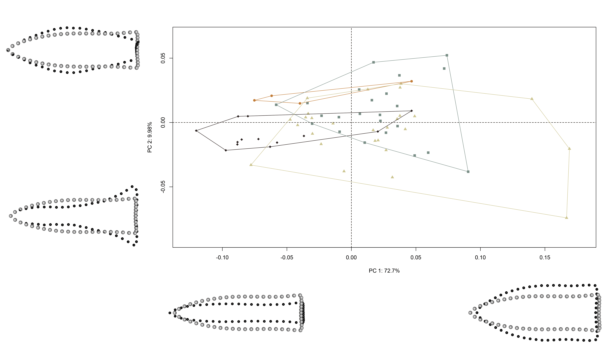

--- 
title: "Mortuary assemblage diversity, Gahagan biface morphology, and the evolution of a Caddo burial tradition in the American Southeast"
author: 
    - Robert Z. Selden, Jr.^[Heritage Research Center, Stephen F. Austin State University; Department of Biology, Stephen F. Austin State University; and Cultural Heritage Department, Jean Monnet University, zselden@sfasu.edu], John E. Dockall^[Stantec, Inc.], and David L. Carlson^[Department of Anthropology, Texas A&M University]
date: "`r Sys.Date()`"
site: bookdown::bookdown_site
bibliography: [book.bib]
biblio-style: apalike
link-citations: yes
description: "Gahagan biface shape change."
---

# Preface {-}

>Reproducibility---the ability to recompute results---and replicability---the chances other experimenters will achieve a consistent result---are two foundational characteristics of successful scientific research [@RN20918].

## Basis of inquiry

Contextual differences in Caddo burials that included Gahagan bifaces indicate two discrete burial traditions; one where a biface was placed _atop or alongside an individual_ and another where a cache of Gahagan bifaces was placed _along the northern wall of the burial feature_. This study asks whether assemblage diversity and evenness---for mortuary contexts associated with Gahagan bifaces---increases through time, and whether Gahagan biface morphology may differ based on context. A seriation of mortuary contexts paired with an analysis of mortuary assemblage diversity highlights changes in Caddo burial assemblages through time, where the earliest contexts express lower diversity and evenness than later contexts. Results also indicate that Gahagan biface morphology differs between Caddo burial traditions, indicating discrete communities of practice related to both object placement and shape preference. These findings comprise the basis for a discussion of the establishment, maintenance, and evolution of the Caddo burial practice that included Gahagan bifaces.

```{r gahagan bifaces 2D, out.width = "100%", dpi = 300, echo=TRUE, warning=FALSE, fig.cap="Gahagan bifaces from the northern and southern `Caddo behavioral regions`. Bifaces recovered atop or alongside an individual denoted by black dot. Additional information for each biface, including the option to download full-resolution 2D images of individual bifaces, can be found at [https://scholarworks.sfasu.edu/ita-gahaganbiface/](https://scholarworks.sfasu.edu/ita-gahaganbiface/)."}
knitr::include_graphics('images/fig02.jpg')
```

## Primary findings

### Increase in mortuary assemblage diversity as a function of time

**Hypothesis: Caddo mortuary assemblages associated with Gahagan bifaces increase in diversity following initial deposition.**

This hypothesis is tested using counts of attributes and associated diagnostic artefacts recovered from Caddo mortuary contexts at the Mounds Plantation, George C. Davis, and Gahagan Mounds site where Gahagan bifaces were included as part of the mortuary assemblage. The hypothesis assesses whether diagnostic material culture objects included with Caddo burials became more diverse and evenly distributed among the types as burial practices evolved.

```{r abundance, out.width = "100%", dpi = 300, echo=TRUE, warning=FALSE, fig.cap="Relative abundance of a, adults and juveniles (binned to encompass all age categories from sub-adult to fetus); b, lithic and ceramic artifacts; and c, diagnostic artefact types recovered from Caddo mortuary contexts that included a Gahagan biface. Contexts ordered temporally from bottom to top based on results of seriation (see Chapter 2). The middle two contexts (16RR1-BP2 and 16CD12-BP5) are interchangeable."}
knitr::include_graphics('images/abundance.png')
```

#### _Findings_:

- Juveniles were not included in the three latest assemblages that include Gahagan bifaces
- Lithics comprise 75% or more---in three cases, 100%---of those Caddo burial assemblages where Gahagan bifaces were recovered
- Caddo mortuary contexts that occur following initial deposition include a **significantly greater diversity** of associated diagnostics
- Caddo mortuary contexts that occur following initial deposition include **significantly greater evenness** across the types

```{r diversity.out, out.width = "100%", dpi = 300, echo=TRUE, warning=FALSE, fig.cap="Caddo burial assemblages that include Gahagan bifaces; 1, 41CE19-F134; 2, 41CE19-F119; 3, 16RR1-BP2; 4, 16RR1-BP3; 5, 16CD12-BP1; 6, 16CD12-BP2; 7, 16CD12-BP5; 8, 16CD12-BP8. The three sites in the lower part of the left quadrat exhibit lower diversity and evenness, and each represents the earliest context at each site to include a Gahagan biface. Those sites in the upper right quadrat have higher diversity and evenness, and occur later than those in the lower left quadrat."}
knitr::include_graphics('images/diversity2-1.png')
```

#### _Summary of results_

The hypothesis was tested using counts of associated diagnostic artefacts recovered from Caddo mortuary contexts at the Mounds Plantation, George C. Davis, and Gahagan Mound sites where Gahagan bifaces were included as part of the mortuary assemblage. The hypothesis assessed whether diagnostic material culture objects included with Caddo burials became more diverse and evenly distributed among the types as burial practices evolved. This follows with an expected increase in assemblage diversity during the cultural and subsistence-based transition from mobile horticulture to emergent--and more sedentary--agricultural communities.

Results demonstrate that lithics comprise 75% or more---in three cases, 100%---of those Caddo burial assemblages where Gahagan bifaces were recovered, as well as a significant increase in the diversity and evenness of diagnostic artefacts included in Caddo burial contexts with Gahagan bifaces. This general trend articulates with the development, maintenance, and evolution associated with a Caddo burial practice. These assemblages are dominated by lithic diagnostics, and ceramics are absent from three of the burial contexts. Further discussion related to diagnostic types that do/do not transcend specific spatial and temporal boundaries are included in the manuscript.

### Shape preference as a function of burial practice

**Hypothesis: Gahagan bifaces from individual and cache contexts differ through time as assemblage diversity increases.**

This hypothesis is tested using Gahagan bifaces recovered from four discrete contexts; the first interred with an _individual_ in the earliest (_initial_) burial context at each site, the second interred as part of a _cache_ in the earliest (_initial_) burial context at each site, the third interred with an _individual_ in _subsequent_ burial contexts, and the fourth interred as a _cache_ in _subsequent_ burial contexts. Distinct Caddo burial practices may have been constrained by local morphological requirements, highlighting aspects of differential shape preference as the diversity of Caddo mortuary assemblages increased.

The analysis employs _four discrete categories_ to assess morphological changes through time:

-   **Initial Individual**: from initial burial contexts that included Gahagan bifaces at each site, and interred atop or alongside an individual
-   **Initial Cache**: from initial burial contexts that included Gahagan bifaces at each site, and interred as part of a cache along the northern wall of the burial feature
-   **Subsequent Individual**: from subsequent burial contexts that included Gahagan bifaces at each site, and interred atop or alongside an individual
-   **Subsequent Cache**: from subsequent burial contexts that included Gahagan bifaces at each site, and interred as part of a cache along the northern wall of the burial feature

#### _Findings_:

-   Gahagan bifaces from _Initial Cache_ and _Subsequent Individual_ contexts **differ significantly in _shape_**
-   Gahagan bifaces from _Subsequent Cache_ and _Subsequent Individual_ contexts **differ significantly in _shape_**
-   Gahagan bifaces from _Initial Cache_ and _Initial Individual_ contexts **differ significantly in _size_**
-   Gahagan bifaces from _Initial Individual_ and _Subsequent Cache_ contexts **differ significantly in _size_**
-   Gahagan bifaces from _Initial Individual_ and _Subsequent Individual_ contexts **differ significantly in _size_**

```{r h2.box, out.width = "100%", dpi = 300, echo=TRUE, warning=FALSE, fig.cap="In the comparison of Gahagan bifaces from discrete burial contexts, gray dots represent the mean shape at the top of the column, and black dots represent the mean shape at right. All comparisons in the first column differ significantly in size, those in the second column differ significantly in shape, and those in the third column do not differ in shape or size."}
knitr::include_graphics('images/comp.composite.jpg')
```

#### Summary of results

This hypothesis was tested using Gahagan bifaces recovered from four discrete contexts; the first interred with an _individual_ in the earliest (_initial_) burial context at each site, the second interred as part of a _cache_ in the earliest (_initial_) burial context at each site, the third interred with an _individual_ in _subsequent_ burial contexts, and the fourth interred as a _cache_ in _subsequent_ burial contexts. Distinct Caddo burial practices may have been constrained by local morphological requirements, highlighting aspects of differential shape preference as the diversity of Caddo mortuary assemblages increased.

Results demonstrate a significant difference in shape or size through time for all but one context (caches), which is potentially representative of **design intent**. Contextual differences suggest two distinct Caddo burial traditions associated with Gahagan bifaces; one more prevalent in the northern behavioral region where Gahagan bifaces were placed _atop or alongside an individual_, and one more prevalent in the southern behavioral region where six Gahagan bifaces were buried atop or alongside an individual, and the remainder were _included as a cache offering along the northern periphery of the burial_. Each burial tradition appears to have been bounded by its' own community of practice relating both to the placement of the bifaces, and the design (shape) of those Gahagan bifaces interred in each context.

The temporal component is delimited by the same _initial_ and _subsequent_ contexts used in the analysis of assemblage diversity. That there are no cache offerings of Gahagan bifaces associated with the northern behavioral region raises questions regarding whether the spatial boundary may have been permeable, but in only one direction.

## Acknowledgments {-}

RZS extends his gratitude to the Caddo Nation of Oklahoma, the Caddo Nation Tribal Council, Tribal Chairman, and Tribal Historic Preservation Office for their guidance related to the development of the 3D scanning protocols, for permission and access to NAGPRA and previously repatriated collections, and for frank discussions related to language surrounding burial contexts associated with Caddo children. Additional thanks to the Williamson Museum at Northwestern State University, Louisiana State Exhibit Museum, Texas Archeological Research Laboratory at The University of Texas at Austin, Brazos Valley Museum of Natural History, Texas Parks and Wildlife Department, and Sam Noble Oklahoma Museum of Natural Science for providing access to the Gahagan bifaces. RZS expresses his gratitude to Harry J. Shafer, Hiram F. (Pete) Gregory, Christian S. Hoggard, and David K. Thulman for their comments and constructive criticisms on the analyses of Gahagan biface morphology.

We wish to thank Christian S. Hoggard and David K. Thulman for their thoughtful comments and constructive criticisms of the landmarking protocol used in this study ([`LM3d1`](https://github.com/aksel-blaise/gahaganmorph2/blob/master/analysis/landmarking-protocol.md)), as well as the landmarking protocol for Gahagan bifaces that will be used in subsequent analytical efforts ([`LM3d2`](https://github.com/seldenlab/gahaganmorph.3/blob/main/lm3d2/03-landmarking-protocol.Rmd)); to Martin Hinz for fielding questions related to the `oxcAAR` package, to Derek Hamilton for his guidance with the chronological models; and to Dean C. Adams, Michael L. Collyer, Emma Sherratt, Lauren Butaric, and Kersten Bergstrom for their constructive criticisms, general comments, and suggestions throughout the development of this research program.

## Funding {-}

Components of this analytical work flow were developed and funded by a Preservation Technology and Training grant (P14AP00138) to RZS from the National Center for Preservation Technology and Training (NCPTT), and additional grants to RZS from the Caddo Tribe of Oklahoma, National Forests and Grasslands in Texas (15-PA-11081300-033) and the United States Forest Service (20-PA-11081300-074). Funding to scan the Gahagan bifaces at the Williamson Museum at Northwestern State University, Louisiana State Exhibit Museum, Texas Archeological Research Laboratory at The University of Texas at Austin, and Sam Noble Oklahoma Museum of Natural Science was provided to the RZS by the Heritage Research Center at Stephen F. Austin State University.

## Data management {-}

This volume is written in _Markdown_, and all files needed to reproduce the analytical findings are included in the [GitHub repository](https://github.com/seldenlab/gahaganmorph.3), which is digitally curated on the Open Science Framework. The reproducible nature of this undertaking provides a means for others to critically assess and evaluate the various analytical components [@RN20915;@RN20916;@RN20917], which is a necessary requirement for the production of reliable knowledge.

Reproducibility projects in [psychology](https://osf.io/ezcuj/) and [cancer biology](https://www.cos.io/rpcb) are impacting current research practices across all domains. Examples of reproducible research are becoming more abundant in archaeology [@RN20804;@RN21009;@RN11783;@RN21001;@RN9364], and the next generation of archaeologists are learning those tools and methods needed to reproduce and/or replicate research results [@RN21007]. Reproducible and replicable research work flows are often employed at the highest levels of humanities-based inquiries to mitigate concern or doubt regarding proper execution, and is of particular import should the results have---explicitly or implicitly---a major impact on scientific progress [@RN21008].

The analysis code associated with this project can be accessed through this document or the [GitHub](https://github.com/seldenlab/gahaganmorph.3) repository, which is digitally curated on the Open Science Framework [DOI: 10.17605/OSF.IO/Y7B39](https://osf.io/y7b39/).

## Colophon {-}

This version of the analysis was generated on `r Sys.time()` using the following computational environment and dependencies: 

```{r colophon, cache = FALSE}
# which R packages and versions were used?
if ("devtools" %in% installed.packages()) devtools::session_info()
```

Current Git commit details are:

```{r}
# where can I find this commit? 
if ("git2r" %in% installed.packages() & git2r::in_repository(path = ".")) git2r::repository(here::here())  
```

<!--chapter:end:index.Rmd-->

# Calibrate + Model Legacy Dates

Further information regarding the radiocarbon dates discussed below can be found in the text of the previous article [@RN21001]. A table of associated diagnostic artifacts is included as a means of providing information related to relative dates.

```{r install, echo = TRUE}
devtools::install_github('ISAAKiel/oxcAAR')
# load oxcAAR and OxCal
library(kableExtra)
library(oxcAAR)
quickSetupOxcal()
```

## Calibration and plots for dates from Burial Pit 5 at the Mounds Plantation site

Three dates (Tx-55, Tx-56, and M-1466) were reported from Burial Pit 5 at the Mounds Plantation site. More information about these dates can be found in the text, and those works cited within the text of the manuscript.

```{r mplcal, echo=TRUE}
moundspl<-data.frame(bp=c(860,900),
                     std=c(120,100),
                     names=c("Tx-55","M-1466")
)
moundsplcal<-oxcalCalibrate(moundspl$bp,moundspl$std,moundspl$names)
moundsplcal
plot(moundsplcal)
calcurve_plot(moundsplcal)
```

## Calibration and plots for dates from Burial Pit 2 at the Gahagan Mound site

Three AMS dates (UGA12296, ISGS A0465, and ISGS A0466) were reported from Burial Pit 2 at the Gahagan Mound site. More information about these dates can be found in the text, and those works cited within the text of the manuscript.

```{r gahagancal, echo=TRUE}
gahagan<-data.frame(bp=c(1000,950,910),
                    std=c(40,40,35),
                    names=c("UGA-12296","ISGS-A0466","ISGS-A0465")
)
gahagancal<-oxcalCalibrate(gahagan$bp,gahagan$std,gahagan$names)
gahagancal
plot(gahagancal)
calcurve_plot(gahagancal)
```

## Calibration and plots for the dates from F119 and F134 at the George C. Davis site

Two dates (Tx-913 and Tx-1206) were reported from Features 119 and 134, respectively. More information about these dates can be found in the text and cited references.

```{r GCDcal, echo=TRUE}
gcd<-data.frame(bp=c(1150,986),
                std=c(80,90),
                names=c("Tx-913","Tx-1206")
)
gcdcal<-oxcalCalibrate(gcd$bp,gcd$std,gcd$names)
gcdcal
plot(gcdcal)
calcurve_plot(gcdcal)
```

## Chronological model for burial contexts yielding Gahagan bifaces

For reasons discussed by Selden and colleagues [-@RN21001], Tx-1206 and Tx-56 are included in the model as outliers. 

```{r chronmod1, echo=TRUE, eval = FALSE}
# chronological model
gahaganmod <- 'Plot()
 {
  Phase("Burial contexts yielding Gahagan bifaces")
  {
   Sequence("George C. Davis")
   {
    Boundary("start George C. Davis");
    Phase("F119")
    {
     R_Date("Tx-913", 1150, 80);
    };
    Phase("F134")
    {
     R_Date("Tx-1206", 986, 90)
     {
      Outlier();
     };
    };
    Boundary("end George C. Davis");
   };
   Sequence("Mounds Plantation")
   {
    Boundary("start Mounds Plantation");
    Phase("Burial Pit 2")
    {
     R_Combine("Log 1")
     {
      R_Date("M-1466", 900, 100);
      R_Date("Tx-55", 860, 120);
     };
     R_Date("Tx-56", 475, 100)
     {
      Outlier();
     };
    };
    Boundary("end Mounds Plantation");
   };
   Sequence("Gahagan Mound")
   {
    Boundary("start Gahagan Mound");
    Phase("Burial Pit 2")
    {
     R_Date("UGA-12296", 1000, 40);
     R_Date("ISGS-A0466", 950, 40);
     R_Date("ISGS-A0465", 910, 35);
    };
    Boundary("end Gahagan Mound");
   };
  };
 };
'
  gahaganmod_results <- executeOxcalScript(gahaganmod) 
  gahaganmod_text <- readOxcalOutput(gahaganmod_results)
  gahaganmod_result_data <- parseOxcalOutput(gahaganmod_text, 
                                             only.R_Date = F)
  str(gahaganmod_result_data)
  print(gahaganmod_result_data)
  plot(gahaganmod_result_data)
  
#plot start/end boundaries for contexts yielding gahagan bifaces
  gahaganmod_result_data %>%
    sapply(function(x) x$type %in% c("Boundary")) %>%
    gahaganmod_result_data[.] %>%
    oxcAAR:::plot.oxcAARCalibratedDatesList()
```

```{r gahagan14cprint, out.width = "100%", dpi = 300, echo=TRUE, warning=FALSE}
# embed image
knitr::include_graphics('images/gahagan-chronology.jpg')
```

<!--chapter:end:01-gahagan14c.Rmd-->

# Seriation

Load the data and summarize row and column sums. Also create gahagan_ct with only the counts using context and region as rownames. Finally create gahagan_pct with percentages.

```{r load}
library(ca)
library(plotrix)
# gahagan <- read.csv("gahagan-diagnostics.csv")
# save(gahagan, file="gahagan-diagnostics.RData")
load("gahagan-diagnostics.RData")
# Structure of the data frame
str(gahagan, give.attr=FALSE)
print(gahagan)
# Row sums
(RS <- rowSums(gahagan[, -(1:2)]))
# Column sums
CS <- colSums(gahagan[, -(1:2)])
as.matrix(CS)
gahagan_ct <- gahagan[, -(1:2)]
labels <- paste0(gahagan$context, " (", substr(gahagan$region, 1, 1), ")")
rownames(gahagan_ct) <- labels
gahagan_pct <- gahagan_ct / RS  * 100
```

Use the first dimension of a corresponce analysis on gahagan_ct to provide an initial ordering of the data (ca_ord).

```{r ca, out.width = "100%", dpi = 300, echo=TRUE, warning=FALSE}
gahagan_ca <- ca(gahagan_ct)
plot.ca(gahagan_ca, labels=c(0, 2), cex = .75)
# Correspondence Analysis Ordering on Dimension 1
(ca_ord <- order(gahagan_ca$rowcoord[, 1]))
```

Use the first projection of a detrended corresponce analysis on gahagan_ct to provide an alternate ordering of the data (dec_ord). Use correlation to compare the two sequences. Detach packages that contain functions that interfere with the seriation package.

```{r decorana, out.width = "100%", dpi = 300, echo=TRUE, warning=FALSE}
library(vegan)
gahagan_dec <- decorana(gahagan_ct)
plot(gahagan_dec, display="species")
points(gahagan_dec, display="sites")
# Decorana Ordering on Projection 1
(dec_ord <- order(gahagan_dec$rproj[, 1]))
(cor.test(ca_ord, dec_ord, method="kendall"))
detach("package:vegan")
detach("package:permute")
```

Load the seriation package to use the the manhattan distance matrices to compare the orderings. Robinson developed the method of seriation by permuting distance matrices. He used a similarity matrix where 200 was the index value for an ordering with itself. A perfect matrix should show consistent *decreases* from the diagonal horizontally and vertically. The seriation package implements this as a manhattan distance matrix where 0 is the index value for an ordering with itself. A perfect matrix should show consistent *increases* from the diagonal horizontally and vertically. The AR measure (Anti-Robinson) counts the number of times there is a decrease between adjacent values. The AR_deviation measure weights the index by the difference in values. These are loss measures meaning that low values are better. The Gradient_raw and Gradient_weighted indices are similar, but look at triplets. These are merit measures meaning that higher values are better. There are other options, but these are relatively straightforward.

The seriation package has multiple methods for seriating distance matrices. The ARSA (Anti-Robinson seriation by simulated annealing) method attempts to minimize the linear seriation criterion defined by Robinson. Two other methods use branch and bound algorithms (BBURCG and BBWRCG) focus on the gradient measures.

The five ordinations are then compared to the original order of the data. The detrended correspondence ordering is better than the correspondence ordering, but the permutation orderings are better. The ARSA and BBWRCG oderings are the same and the BBURCG ordering differs only by the switching of the positions of 16RR1-BP2 (S) and 16CD12-BP5 (N). The first (and third) orderings have the best values for AR_deviations (lowest) and Gradient_weighted (highest) whereas the second ordering has the best values for AR_events (lowest) and Gradient_raw (highest).

The battleship plot shows the first ordering. 

```{r seriation, out.width = "100%", dpi = 300, echo=TRUE, warning=FALSE}
library(seriation)
gahagan_dist <- dist(gahagan_pct, method="manhattan")
# Distance matrix:
round(gahagan_dist, 1)
set.seed(42)
gahagan_ser1 <- seriate(gahagan_dist, method="ARSA")
gahagan_ser2 <- seriate(gahagan_dist, method="BBURCG")
gahagan_ser3 <- seriate(gahagan_dist, method="BBWRCG")
ord1 <- get_order(gahagan_ser1)
ord2 <- get_order(gahagan_ser2)
ord3 <- get_order(gahagan_ser3)
# Suggested orderings
rbind(ord1, ord2, ord3)

Crit <- c("AR_events", "AR_deviations", "Gradient_raw", "Gradient_weighted")
gahagan_ord1 <- permute(gahagan_dist, ord1)
gahagan_ord2 <- permute(gahagan_dist, ord2)
gahagan_ord3 <- permute(gahagan_dist, ord3)
gahagan_dec_ord <- permute(gahagan_dist, dec_ord)
gahagan_ca_ord <- permute(gahagan_dist, ca_ord)

# Comparison between original and ordered:
Results <- list(Original=gahagan_dist, Ordered1=gahagan_ord1, Ordered2=gahagan_ord2, Ordered3=gahagan_ord3, CA=gahagan_ca_ord, DEC=gahagan_dec_ord)
round(sapply(Results, criterion, method=Crit), 1)

battleship.plot(gahagan_pct[ord1, ], col="gray", cex.labels = .75)
```

Since there are only eight contexts, it is feasible to consider all possible orderings to see if the preceding analysis found the best ordering. With 8 rows, there are 40,320 permutations, but half of these are reversals so we only need to consider the first 20,160 permutations. This takes a few minutes but it allows us to get the best ordering for each criterion. In this case the two "best" orderings are the same two that the seriation function provided.

```{r exhaustive, out.width = "100%", dpi = 300, echo=TRUE, warning=FALSE}
library(e1071)
library(seriation)
rows <- nrow(gahagan_pct)
perm <- permutations(rows)
nperm <- factorial(rows) / 2
all_perms <- t(sapply(seq(nperm), function(i) criterion(gahagan_dist, perm[i,], method=Crit)))

# Permutations which minimize AR (first two) or maximize Gradient (second two) measures:
# Permutation with mimimum AR events:
which.min(all_perms[, 1])
# Permutation with mimimum AR deviations:
which.min(all_perms[, 2])
# Permutation with maximum Gradient raw score:
which.max(all_perms[, 3])
# Permutation with maximum Gradient weighted score:
which.max(all_perms[, 4])
# Best order for event/raw count:
perm[2034, ]
# Best order for deviation/weighted score:
perm[2634, ]
# Quantiles for all measures:
# AR events (lower is better):
quantile(all_perms[, 1], probs=c(0, .01, .25, .50, .75, .99, 1))
# AR deviations (lower is better):
round(quantile(all_perms[, 2], probs=c(0, .01, .25, .50, .75, .99, 1)))
# Gradient raw score (higher is better):
quantile(all_perms[, 3], probs=c(0, .01, .25, .50, .75, .99, 1))
# Gradient weighted score (higher is better):
round(quantile(all_perms[, 4], probs=c(0, .01, .25, .50, .75, .99, 1)))
battleship.plot(gahagan_pct[perm[2034, ], ], col="gray", cex.labels = .75)
battleship.plot(gahagan_pct[perm[2634, ], ], col="gray", cex.labels = .75)
# gahagan.dst <- round(dist(gahagan_pct[perm[2034, ], ], method="manhattan", diag=TRUE, upper=TRUE), 1)
# par(mar=c(0, 0, 0, 0))
# image(as.matrix(gahagan.dst), ylim=c(1.1, -0.1), asp=1, xaxt="n", yaxt="n", frame.plot=FALSE)
# image(200 - as.matrix(gahagan.dst), ylim=c(1.1, -0.1), asp=1, xaxt="n", yaxt="n", frame.plot=FALSE)
```

We can conclude that (5 1 4 [3 7] 2 6 8) and (5 1 4 [7 3] 2 6 8) are the best seriations for these data. The brackets indicate the only difference between the two. However, given the relatively small sample sizes, it may be that sampling fluctuations could make other orderings better. 

Running the North and South groups separately produces the same orderings (although South is reversed). Since the tied contexts were one North and one South, it did not have any effect on the separate orderings.

```{r twogroups, out.width = "100%", dpi = 300, echo=TRUE, warning=FALSE}

# North contexts
north <- grep("(N)", rownames(gahagan_pct))
north_pct <- gahagan_pct[north, ]
north_dist <- dist(north_pct, method="manhattan")
northrows <- nrow(north_pct)
northperm <- permutations(northrows)
northnperm <- factorial(northrows) / 2
# There are only 12 permutations to check
north_perms <- t(sapply(seq(northnperm), function(i) criterion(north_dist, northperm[i,], method=Crit)))
round(north_perms, 1)
northbest <- c(which.min(north_perms[, "AR_events"]), which.min(north_perms[, "AR_deviations"]),
     which.max(north_perms[, "Gradient_raw"]), which.max(north_perms[, "Gradient_weighted"]))
# All four criteria agree on permutation 4
northbest
north_ser <- northperm[northbest[1], ]
rownames(north_pct)[north_ser]
battleship.plot(north_pct[north_ser, ], col="gray", cex.labels = .75)

# South contexts
south <- grep("(S)", rownames(gahagan_pct))
south_pct <- gahagan_pct[south, ]
south_dist <- dist(south_pct, method="manhattan")
southrows <- nrow(south_pct)
southperm <- permutations(southrows)
southnperm <- factorial(southrows) / 2
# There are only 12 permutations to check
south_perms <- t(sapply(seq(southnperm), function(i) criterion(south_dist, southperm[i,], method=Crit)))
round(south_perms, 1)
southbest <- c(which.min(south_perms[, "AR_events"]), which.min(south_perms[, "AR_deviations"]),
     which.max(south_perms[, "Gradient_raw"]), which.max(south_perms[, "Gradient_weighted"]))
# All four criteria agree on permuation 7
southbest
south_ser <- southperm[southbest[1], ]
rownames(south_pct)[south_ser]
# Reverse South for battlship plot
battleship.plot(south_pct[rev(south_ser), ], col="gray", cex.labels = .75)
```


<!--chapter:end:02-seriate.Rmd-->

# Composition & Diversity

This analysis of assemblage diversity is limited to Caddo mortuary contexts at the Mounds Plantation, George C. Davis, and Gahagan Mound sites where Gahagan bifaces were recovered.

## Taxonomic composition

```{r composistion}
library(here)
library(tidyverse)

# read data
data <- read.csv("gahagan-diversity.csv")

# table of diagnostics
knitr::kable(data)
```

## Alpha diversity

```{r diversity, out.width = "100%", dpi = 300, echo=TRUE, warning=FALSE}
library(vegan)

# assemblage size (N)
N <- rowSums(data[11:25])
N ## assemblage sizes range from:

# how many of each type were found?
T <- colSums(data[11:25])
T

## richness (S) = number of types in assemblage
S <- specnumber(data[11:25])
S

## ubiquity (U) = number of assemblages that contain a particular type
U <- specnumber(data[11:25])
U
```

## Relative abundance

```{r relative.abundance}
# mean number of observations for each type
colMeans(data[11:25])

# data by percentage
data.pct <- data[11:25]/N*100
## mean percent (Mp) of each type across assemblage
Mp <- colMeans(data.pct)
Mp

## percentage of sites that have each type
Up <- U/length(N)*100
Up
```

### Relative abundance by context

```{r plot.burial.diversity, out.width = "100%", dpi = 300, echo=TRUE, warning=FALSE, fig.cap="Relative abundance of age and sex data associated with burials. For this undertaking, the term juvenile encompassess all age categories from fetus to sub-adult. Contexts ordered temporally from bottom to top based upon seriation results provided in the previous chapter. The middle two contexts (16RR1-BP2 and 16CD12-BP5) are interchangeable."}
library(dplyr)
library(reshape)
library(ggplot2)
library(ggpubr)
library(ggExtra)
library(wesanderson)

# relative abundance of juvenile and adult burials
pal <- wes_palette("Moonrise2", 2, type = "continuous")

burials <- data %>% 
  select(context, total_adult, total_juvenile) %>% 
  mutate(context = paste(context, c("(S)", "(S)", "(S)", "(S)",
                                    "(N)", "(N)", "(N)", "(N)"))) %>% 
  melt(id.vars = "context")

# configure plot
plot0 <- burials %>%
  arrange(context) %>% 
  mutate(context = factor(context, levels = c(
                            "16CD12-BP1 (N)", "41CE19-F134 (S)", "16RR1-BP3 (S)",
                            "16CD12-BP5 (N)", "16RR1-BP2 (S)", "41CE19-F119 (S)", 
                            "16CD12-BP2 (N)", "16CD12-BP8 (N)"))) %>% 
  ggplot(aes(x=context, y = value, fill = variable)) + 
  geom_bar(stat="identity", position = "fill") + 
  coord_flip() +
  scale_fill_manual(values = pal) +
  labs(x = "Context",
       y = "Relative abundance (%)",
       fill = "Category")

# relative abundance of burials by category
pal <- wes_palette("Moonrise2", 6, type = "continuous")

burials <- data %>% 
  select(context, adult_male:uid_adult, juvenile_male:uid_juvenile) %>% 
  mutate(context = paste(context, c("(S)", "(S)", "(S)", "(S)",
                                    "(N)", "(N)", "(N)", "(N)"))) %>% 
  melt(id.vars = "context")

# configure plot
plot00 <- burials %>%
  arrange(context) %>% 
  mutate(context = factor(context, levels = c(
                            "16CD12-BP1 (N)", "41CE19-F134 (S)", "16RR1-BP3 (S)",
                            "16CD12-BP5 (N)", "16RR1-BP2 (S)", "41CE19-F119 (S)", 
                            "16CD12-BP2 (N)", "16CD12-BP8 (N)"))) %>% 
  ggplot(aes(x=context, y = value, fill = variable)) + 
  geom_bar(stat="identity", position = "fill") + 
  coord_flip() +
  scale_fill_manual(values = pal) +
  labs(x = "Context",
       y = "Relative abundance (%)",
       fill = "Category")

# render figure
figure <- ggarrange(plot0, plot00,
                      labels = c("a","b"),
                      ncol = 1, nrow = 2)

# plot figure
figure
```

```{r plot.alpha.diversity, out.width = "100%", dpi = 300, echo=TRUE, warning=FALSE, fig.cap="Relative abundance of associated diagnostics. Contexts ordered temporally from bottom to top based upon seriation results provided in the previous chapter. The middle two contexts (16RR1-BP2 and 16CD12-BP5) are interchangeable."}
# relative abundance of lithics + ceramics
pal <- wes_palette("Moonrise2", 2, type = "continuous")

cerlith <- data %>% 
  select(context, lithics, ceramics) %>% 
  mutate(context = paste(context, c("(S)", "(S)", "(S)", "(S)",
                                    "(N)", "(N)", "(N)", "(N)"))) %>% 
  melt(id.vars = "context")

# configure plot
plot1 <- cerlith %>%
  arrange(context) %>% 
  mutate(context = factor(context, levels = c(
                            "16CD12-BP1 (N)", "41CE19-F134 (S)", "16RR1-BP3 (S)",
                            "16CD12-BP5 (N)", "16RR1-BP2 (S)", "41CE19-F119 (S)", 
                            "16CD12-BP2 (N)", "16CD12-BP8 (N)"))) %>% 
  ggplot(aes(x=context, y = value, fill = variable)) + 
  geom_bar(stat="identity", position = "fill") + 
  coord_flip() +
  scale_fill_manual(values = pal) +
  labs(x = "Context",
       y = "Relative abundance (%)",
       fill = "Category")

# relative abundance of diagnostic types
pal <- wes_palette("Moonrise2", 17, type = "continuous")

diagnostics <- data %>% 
  select(context, alba:ceramic_bowl) %>% 
  mutate(context = paste(context, c("(S)", "(S)", "(S)", "(S)",
                                    "(N)", "(N)", "(N)", "(N)"))) %>% 
  melt(id.vars = "context")

# configure plot
plot2 <- diagnostics %>% 
  arrange(context) %>% 
  mutate(context = factor(context, levels = c(
                            "16CD12-BP1 (N)", "41CE19-F134 (S)", "16RR1-BP3 (S)",
                            "16CD12-BP5 (N)", "16RR1-BP2 (S)", "41CE19-F119 (S)", 
                            "16CD12-BP2 (N)", "16CD12-BP8 (N)"))) %>% 
  ggplot( aes(x=context, y = value, fill = variable)) + 
  geom_bar(stat="identity", position = "fill") + 
  coord_flip() +
  scale_fill_manual(values = pal) +
  labs(x = "Context",
       y = "Relative abundance (%)",
       fill = "Types") +
  theme(legend.key.height = unit(0.05, "cm"))

# render figure
figure <- ggarrange(plot1, plot2,
                      labels = c("c","d"),
                      ncol = 1, nrow = 2)

# plot figure
figure
```

## Diversity indices

```{r diversity.indices, out.width = "100%", dpi = 300, echo=TRUE, warning=FALSE}
# diversity - diagnostics
# Simpson diversity
data$D1 <- diversity(data[11:25], index = "simpson")
D1 <- data$D1

# evenness - diagnostics
# Shannon diversity
data$H <- diversity(data[11:25])
H <- data$H

# Pielou's J (Shannon diversity index divided by natural log of richness)
data$J <- H/log(S)
J <- data$J
```

## Beta diversity - diagnostics

```{r diversity2, out.width = "100%", dpi = 300, echo=TRUE, warning=FALSE, fig.cap="Caddo burial assemblages that include Gahagan bifaces; 1, 41CE19-F134; 2, 41CE19-F119; 3, 16RR1-BP2; 4, 16RR1-BP3; 5, 16CD12-BP1; 6, 16CD12-BP2; 7, 16CD12-BP5; 8, 16CD12-BP8. The three sites in the lower part of the left quadrat exhibit lower diversity and evenness, and each represents the earliest context at each site to include a Gahagan biface. Those sites in the upper right quadrat have higher diversity and evenness, and occur later than those in the lower left quadrat."}
# summarize assemblage diversity to identify high & low diversity assemblages
ggplot(data, aes(x = D1, y = J, color = region,
                 shape = region, label = rownames(data))) +
  geom_text(aes(label = rownames(data))) +
  geom_vline(aes(xintercept = median(D1))) +
  geom_hline(aes(yintercept = median(J))) +
  theme(legend.position = c(0.87, 0.15)) +
  labs(color = "Behavioral Region")
```

### Diversity through time

The figure above shows higher diversity and evenness in later contexts. Is there a significant increase in diversity between the initial burial context at each site that included Gahagan bifaces, and those that occur later?

```{r simpson.init.diversity, out.width = "100%", dpi = 300, echo=TRUE, warning=FALSE}
# diversity
# mutate data to add temporal assignment
temp <- data %>%
  mutate(temporal = c(1, 2, 2, 1, 1, 2, 2, 2), .after = region)

# table of diagnostics
knitr::kable(temp, "pipe")

# attributes for plots
temp.D1 <- temp$D1
temp.J <- temp$J
time <- temp$temporal

#diversity
## plot diversity
ggplot(temp, aes(x = time, y = temp.D1)) +
  geom_point(aes(shape = factor(context))) +
  scale_shape_manual(values = c(0:5,15,17)) +
  geom_smooth(method = "lm")

# are data not normally distributed?
shapiro.test(temp.D1)
# plot distribution
hist(temp.D1, col='steelblue')

# MODEL: D1 as a function of initial v. later contexts
temp.simpson <- aov(temp.D1 ~ time, 
                    data = temp)

# ANOVA: do temporal contexts differ by D1?
summary(temp.simpson)
```

### Evenness through time

The figure above shows higher diversity and evenness in later contexts. Is there a significant increase in evenness between the initial burial context at each site that included Gahagan bifaces, and those that occur later?

```{r simpson.init.evenness, out.width = "100%", dpi = 300, echo=TRUE, warning=FALSE}
# evenness

## plot evenness
ggplot(temp, aes(x = time, y = temp.J)) +
  geom_point(aes(shape = factor(context))) +
  scale_shape_manual(values = c(0:5,15,17)) +
  geom_smooth(method = "lm")

# are data not normally distributed?
shapiro.test(temp.J)
# plot distribution
hist(temp.J, col='steelblue')

# MODEL: J as a function of initial v. later contexts
temporal.J <- anosim(temp.J, 
                     grouping = time, 
                     permutations = 10000)

# ANOSIM: do temporal contexts differ by J?
summary(temporal.J)
```

<!--chapter:end:03-diversity.Rmd-->

# 3DGM - Modeling Geometry

Two Gahagan bifaces, both from the George C. Davis site (4078-8, and 4078-72), were missing small sections of the blade along the lateral edge. This analysis limited the inclusion of specimens with missing data to those where the area of missing data was smaller than a dime (10-cent coin in the US), ensuring that modeling was kept to a minimum.

Modeling was completed in _Geomagic Design X (Build Version 2020.0.4 [Build Number: 15])_. In the previous studies [@RN11783;@RN21001], modeling occurred in advance of alignment, which used the `auto3dgm` package in R [@RN8343;@R]. In this iteration, modeling still occurs first, followed by a novel method for assigning the front and back faces of each specimen. Details associated with that method are included in the next chapter. Following alignment, these specimens were landmarked using the same landmarking protocol as the unmodeled bifaces.

In both cases, the area of highest concern was that of the lateral edge. To ensure that the fit followed the existing contour, the area was first cut and cleaned, then bridges were constructed that enlisted variable curvature, following the existing curvature of the edge. Once fitted with the bridge, the remaining holes on either side were filled following those protocols set forth in [@RN11521].

The images that follow include a before and after modeling image of each biface, illustrating the area of the biface that was missing, and the subsequent model that was used in the geometric morphometric analysis. In the case of 4078-8, a single semilandmark was included in the modeled area. No semilandmarks were placed in the modeled area of 4078-72.

## 4078-8

```{r fig4078-8-init, out.width = "100%", dpi = 300, echo=TRUE, warning=FALSE, fig.cap="Gahagan biface 4078-8, before modeling."}
knitr::include_graphics('images/41ce19-4078-8-unmodeled.png')
```

```{r fig4078-8-mod, out.width = "100%", dpi = 300, echo=TRUE, warning=FALSE, fig.cap="Gahagan biface 4078-8, after modeling."}
knitr::include_graphics('images/41ce19-4078-8-modeled.png')
```

## 4078-72

```{r fig4078-72-init, out.width = "100%", dpi = 300, echo=TRUE, warning=FALSE, fig.cap="Gahagan biface 4078-72, before modeling."}
knitr::include_graphics('images/41ce19-4078-72-unmodeled.png')
```

```{r fig4078-72-mod, out.width = "100%", dpi = 300, echo=TRUE, warning=FALSE, fig.cap="Gahagan biface 4078-72, after modeling."}
knitr::include_graphics('images/41ce19-4078-72-modeled.png')
```

<!--chapter:end:04-modeling-geometry.Rmd-->

# 3DGM - Landmarking Protocol

The landmarking protocol used for this study (LM3d1) is identical to that used by Selden and colleagues [@RN21001]; which is appended below, and available at: [https://github.com/aksel-blaise/gahaganmorph2/blob/master/analysis/landmarking-protocol.md](https://github.com/aksel-blaise/gahaganmorph2/blob/master/analysis/landmarking-protocol.md).

The landmarking protocol developed for this project bears some visual similarities with the configuration used in the previous study [@RN11783], as well as other two-dimensional geometric morphometric analyses [@RN1754;@RN1736;@RN11731]; however, it differs in some fundamental ways. The first and most obvious difference is that this is a three-dimensional study. The second is the method of landmark placement, where _Geomagic Design X_ was used to generate a spline around the periphery of each biface, and to populate the landmarks and equidistant semilandmarks in a replicable manner using mathematically-defined criteria.

```{r figbev}
knitr::include_graphics('images/figbev.png')
fig.cap="Gahagan biface 545 from the Gahagan Mound site, illustrating axial twisting. \\label{figbev}"
```

The goal of this effort was to increase the precision and rigour of the study by including the z-dimension to capture those morphological characteristics associated with axial twisting that are introduced through the practice of bifacial beveling. This landmarking protocol represents an intermediate iteration between the previous 2D analysis [@RN11783], and the forthcoming protocol that also includes semilandmarks placed on a series of equidistant cross-sections. The cross-sections increase the coverage of semilandmarks across the mesh topology, and provide for greater precision in the analysis of morphology for the whole object. The evolution of this landmarking protocol represents a concerted effort to better comprehend the vagaries of morphological similarities and differences among Gahagan bifaces. While true that some landmarking protocols can be---and often are---recycled as new specimens are added, this particular research programme endeavours to achieve ever-greater accuracy and precision in each analytical iteration.

### Generating the spline

Unlike the previous study, where the outline of each Gahagan biface was projected onto a 2D plane, this effort enlists a spline extracted from the surface geometry of the mesh using the `extract contour curves` command, which is used to detect and extract 3D contour curves from high-curvature areas of the mesh. In reverse-engineering, `extract contour curves` is regularly employed as the first step in building a `patch network` that is used to create a surface. The extracted feature curve is rendered as a spline, and follows the highest curvature contours around the periphery of the lateral and basal edges, following the highly variable sinuous edge morphology around the entirety of the biface. The remainder of the landmarking protocol is based upon this spline, which was subsequently split at four mathematically-defined locations.

```{r figspline}
knitr::include_graphics('images/extractspline.png')
fig.cap="Spline extracted along the highest contours of the projectile. \\label{figspline}"
```

### Splitting the spline

_A few definitions are warranted before proceeding. `Reference geometries` are used in the assistance of creating other features. These include basic geometric entities, such as `planes`, `vectors`, `coordinates`, `points`, and `polygons`. A `reference point` is a virtual point and is used to mark a specific position on a model or in 3D space. A `reference plane` is a virtual plane that has a normal direction and an infinite size. A `reference plane` is not a surface body, and is used to create other features._ 

The characteristic points and tangents developed for this landmarking protocol were inspired by the work of Birkhoff [-@RN11786]. The first landmark (LM1) is placed at the horizontal tangent on the tip of each Gahagan biface. The second and third splits (LM2 and LM3) occur at points of highest curvature, and LM2 is always split on the right side of the biface when oriented in 3D space following the alignment output of _auto3dgm_, which is illustrated in Figure 7a of the manuscript. To place the final landmark (LM4), a linear measurement was used to project a reference point equidistant between LM2 and LM3. The location of that point was leveraged in placing the reference plane used to cut the spline at the location of LM4.

#### Spline split at location of LM1

The `horizontal tangent` is calculated by drawing a horizontal line above the tip of the biface using the tangent as a `common constraint`, and the horizontal as the `independent constraint`. To split the 3D spline at the location of the horizontal tangent, a `reference point` was inserted at the location of the `tangent` in the 2D sketch (light blue point; below, left), followed by a `reference plane` (in white; below, left and right) using the `pick point and normal axis` function where the `reference point` (h-tangent) was used as the `pick point`, and the `Right plane` as the `normal axis` (below, left). The 3D spline was then cut at the location where the `reference plane` intersected with the spline (below image, right).

```{r figlm1}
knitr::include_graphics('images/lm1.png')
fig.cap="Identify horizontal tangent, insert reference point and reference plane (left). Use reference plane to cut spline at the location of the horizontal tangent (right). \\label{figlm1}"
```

#### Spline split at locations of LM2 and LM3

The point of highest curvature on either side of the basal edge was calculated using the `curvature function` in the Accuracy Analyser. This function displays the curvature flow as a continuous colour plot across the area of the curve. In this instance, _curvature_ is defined as the amount by which a geometric shape deviates from being flat or straight in the case of a line. The curvature is displayed in different colours according to the local radius, and is calculated in only one direction (U or V) along the curve. Using this tool, the two points of highest curvature were located between the basal and lateral edges on either side of each biface where the local radius measure was largest. The alignment and orientation of each biface was dictated by the _auto3dgm_ output (see Figure 7a in the manuscript), and the landmarking protocol follows the mesh orientation in that figure, where LM2 was always placed on the right side of the basal edge, and LM3 on the left.

```{r figcurve}
knitr::include_graphics('images/splinesplit1.png')
fig.cap="Identify points of hightest curvature (light blue) at left/right intersection of lateral and basal edges. \\label{figsplinesplitlr}"
```

#### Spline split at location of LM4

One additional landmark (LM4) was placed at the centre of the base. The location of this landmark was identified by calculating the linear distance between LM2 and LM3, and projecting a `reference point` (ctrl-div; below) equidistant between the two. A `reference plane` was added using the ctrl-div as the pick point, and the `Right plane` as the `normal axis`. The spline was then split at the intersection of the `reference plane` and the basal spline.

```{r figlm4}
knitr::include_graphics('images/lm4.png')
fig.cap="Calculate linear distance between LM2 and LM3, insert reference plane coplanar to Right plane equidistant between LM2 and LM3, and use the reference plane to cut the spline.  \\label{figlm4}"
```

#### Final spline

Through the preceding protocol, the initial spline was split into four discrete splines. These splines articulate with components of bifacial morphology that can be compartmentalised in the subsequent analyses (i.e., left/right [directional] asymmetry, blade/base morphological integration, etc.). The primary analytical gain achieved through this exercise is the requisite foundation needed to carry out replicable analyses of Gahagan biface morphology in three dimensions, further increasing the precision of the geometric morphometric analysis.

```{r figsplinesplit-frbl}
knitr::include_graphics('images/splinesplit-frbl.png')
fig.cap="Result of spline splits include four discrete splines, each articulating with a potential region of analytical interest. \\label{figsplinesplit-frbl}"
```

### Landmark and semilandmark placement

Landmarks 1-4 were placed at the location of each spline split (blue points, below). Equidistant semilandmarks were then added to each of the four splines; 20 between LM1 and LM2, five between LM2 and LM4, five between LM4 and LM3, and 20 between LM3 and LM1.

```{r figlmslm-all}

fig.cap="3D spline with landmarks (blue) and equidistant semilandmarks (white) applied, with top, right, and front planes. Semilandmarks are renumbered in post.  \\label{figlmslm-all}"
```

Superficially, this constellation of landmarks and semilandmarks appears similar to those used in recent 2D studies. However, the rigourous protocol used in the application of landmarks and semilandmarks aids in capturing morphological variation that articulates with axial twisting introduced by knappers through the practice of beveling. Thus, this constellation of landmarks and semilandmarks provides for greater precision in the geometric morphometric analysis, marking a substantive advancement in those analytical protocols used to achieve a more complete and holistic analysis of Gahagan biface morphology.

```{r figbevlm}
knitr::include_graphics('images/figbevlm.png')
fig.cap="Mesh for Gahagan biface 545 from Gahagan Mound with landmarks and equidistant semilandmarks applied. \\label{figbevlm}"
```

<!--chapter:end:05-landmarking-protocol.Rmd-->

# 3DGM - Morphology through time

This 3D geometric morphometric analysis follows recent analyses of Gahagan biface morphology across the southern Caddo area and central Texas [@RN11783;@RN21001], where Gahagan bifaces were found to differ in shape across the same geography as Caddo bottles [@RN11801;@RN11782;@RN11716;@RN8312] and Perdiz arrow points ([Selden and Dockall, this volume](https://github.com/seldenlab/perdiz3/blob/main/ms/perdiz3/perdiz3.pdf)). The analysis, and the two that precede it, builds upon the work of Shafer [-@RN3684;-@RN20701;-@RN4924]. A succinct overview of the analytical procedures used for this analysis is provided in the manuscript, and the analytical code provided in this document can be used to reproduce the results exactly.

_**Hypothesis: Gahagan bifaces from individual and cache contexts differ through time as assemblage diversity increases.**_

This hypothesis is tested using Gahagan bifaces recovered from four discrete contexts; the first interred with an _individual_ in the earliest (_initial_) burial context at each site, the second interred as part of a _cache_ in the earliest (_initial_) burial context at each site, the third interred with an _individual_ in _subsequent_ burial contexts, and the fourth interred as a _cache_ in _subsequent_ burial contexts.

## Load packages + data

```{r load geomorph.div, setwd, and load data, echo=TRUE, warning=FALSE}
# load libraries
library(here)
library(geomorph)
library(tidyr)
library(ggplot2)
library(wesanderson)

source('readmulti.csv.R')

# read .csv files
setwd("./data")
filelist <- list.files(pattern = ".csv")
coords <- readmulti.csv(filelist)
setwd("../")

# read qualitative data
qdata <- read.csv("qdata.csv", header = TRUE, row.names = 1)
qdata <- qdata[match(dimnames(coords)[[3]], rownames(qdata)),]

qdata <- qdata %>% 
  unite("merged", t.context:context, remove = FALSE)
```

## Generalized Procrustes Analysis

Landmark data were aligned to a global coordinate system [@RN11622;@RN11623;@RN11563], achieved through generalized Procrustes superimposition [@RN478] performed in R 4.1.0 [@R] using the `geomorph` library v. 4.0.0 [@RN11530;@RN1774;@RN9565]. Procrustes superimposition translates, scales, and rotates the coordinate data to allow for comparisons among objects [@RN11564;@RN478]. The `geomorph` package uses a partial Procrustes superimposition that projects the aligned specimens into tangent space subsequent to alignment in preparation for the use of multivariate methods that assume linear space [@RN1646;@RN11563]. 

```{r gpa.div, out.width = "100%", dpi = 300, echo=TRUE, warning=FALSE}
Y.gpa <- gpagen(coords,
                PrinAxes = TRUE,
                print.progress = FALSE)
## plot gpa
plot(Y.gpa)

## 3D gpa plot
knitr::include_graphics('images/gpa3d.png')

# geomorph data frame
gdf <- geomorph.data.frame(shape = Y.gpa$coords,
                           size = Y.gpa$Csize,
                           merged = qdata$merged) 

# add centroid size to qdata
qdata$csz <- Y.gpa$Csize

# attributes for boxplot
csz <- qdata$csz
merged <- qdata$merged

# palette
pal <- wes_palette("Moonrise2", 4, type = "continuous")
```

## Boxplot

```{r centsize.box.div, out.width = "100%", dpi = 300, echo=TRUE, warning=FALSE}
# boxplot - centroid size by context
csz.temp <- ggplot(qdata, aes(x = merged, y = csz, color = merged)) +
  geom_boxplot() +
  geom_dotplot(binaxis = 'y', stackdir = 'center', dotsize = 0.3) +
  scale_color_manual(values = pal) +
  theme(legend.position = "none") +
  labs(x = 'Context', y = 'Centroid Size')

## render plot
csz.temp
```

## Principal Components Analysis

Principal components analysis [@RN1746] was used to visualise shape variation among the bifaces. The shape changes described by each principal axis are commonly visualized using thin-plate spline warping of a reference 3D mesh [@RN1731;@RN479]. 

```{r pca1.div, out.width = "100%", dpi = 300, echo=TRUE, warning=FALSE}
# principal components analysis
pca <- gm.prcomp(Y.gpa$coords)
summary(pca)

# set plot parameters to plot by context
pch.gps.context <- c(15:18)[as.factor(merged)]
col.gps.context <- pal[as.factor(merged)]
col.hull.context <- c("#C27D38","#29211F","#798E87","#CCC591")

## plot pca by context 2
pc.plot <- plot(pca, asp = 1,
                pch = pch.gps.context,
                col = col.gps.context)
shapeHulls(pc.plot,
           groups = merged,
           group.cols = col.hull.context)
```

### Plot PCA with mean shape + x/y maxima/minima

```{r pca2.div, out.width = "100%", dpi = 300, echo=TRUE, warning=FALSE}
## plot PCA with mean shape (gray) and x/y maxima/minima (black)

```

## Procrustes ANOVA

A residual randomization permutation procedure (RRPP; n = 10,000 permutations) was used for all Procrustes ANOVAs [@RN1655;@RN11775], which has higher statistical power and a greater ability to identify patterns in the data should they be present [@RN1719]. To assess whether shape changes with size (allometry), and differs by context (context), Procrustes ANOVAs [@RN1749] were also run that enlist effect-sizes (zscores) computed as standard deviates of the generated sampling distributions [@RN1756]. 

```{r define-models.div}
# MODEL: shape as a function of context + time
fit.shapecontemp <- procD.lm(shape ~ merged,
                             data = gdf,
                             print.progress = FALSE,
                             iter = 9999)

# ANOVA: do gahagan biface shapes differ by context + time?
anova(fit.shapecontemp)

# pairwise comparison of LS means = which differ?
pairwise.shapecontemp <- pairwise(fit.shapecontemp,
                                  groups = qdata$merged)
summary(pairwise.shapecontemp, 
        confidence = 0.95, 
        test.type = "dist")

# MODEL: size as a function of context + time
fit.sizecontemp <- procD.lm(size ~ merged,
                            data = gdf,
                            print.progress = FALSE,
                            iter = 9999)

# ANOVA: do gahagan biface sizes differ by context + time?
anova(fit.sizecontemp)

# pairwise comparison of LS means = which differ?
pairwise.sizecontemp <- pairwise(fit.sizecontemp,
                                 groups = qdata$merged)
summary(pairwise.sizecontemp, 
        confidence = 0.95, 
        test.type = "dist")
```

## Mean shapes

```{r m-shapes.div, out.width = "100%", dpi = 300, echo=TRUE, warning=FALSE}
# subset landmark coordinates to produce mean shapes for contexts
new.coords <- coords.subset(A = Y.gpa$coords,
                            group = qdata$merged)

names(new.coords)

## plot shape means
mean <- lapply(new.coords, mshape)
plot(mean$initial_cache)
plot(mean$initial_individual)
plot(mean$subsequent_cache)
plot(mean$subsequent_individual)

# comparison plots
plotRefToTarget(mean$initial_individual,
                mean$initial_cache, 
                method = "points",
                mag = 1)

plotRefToTarget(mean$initial_individual,
                mean$subsequent_individual, 
                method = "points",
                mag = 1)

plotRefToTarget(mean$initial_individual,
                mean$subsequent_cache, 
                method = "points",
                mag = 1)

plotRefToTarget(mean$initial_cache,
                mean$subsequent_individual, 
                method = "points",
                mag = 1)

plotRefToTarget(mean$subsequent_individual,
                mean$initial_cache, 
                method = "points",
                mag = 1)

plotRefToTarget(mean$initial_cache,
                mean$subsequent_cache, 
                method = "points",
                mag = 1)

## 3D plot - final figure
knitr::include_graphics('images/comp.composite.jpg')
```

<!--chapter:end:06-GMdiv.Rmd-->

`r if (knitr::is_html_output()) '
# References {-}
'`

<!--chapter:end:99-references.Rmd-->

