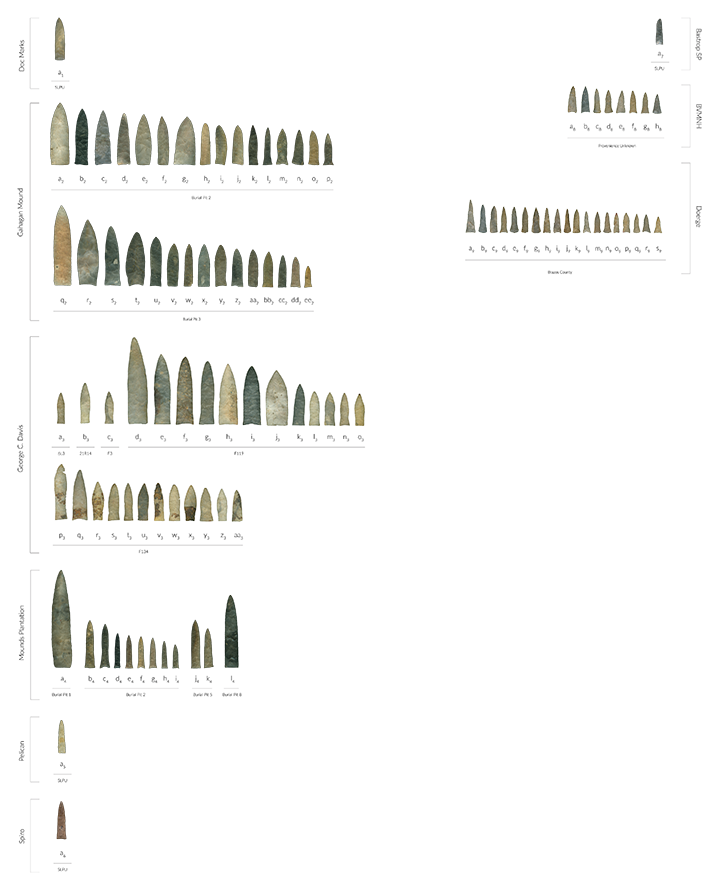

--- 
title: "Supplementary materials for article: Local and regional morphological trajectories of Gahagan bifaces across cultural contexts"
author: 
    - Robert Z. Selden, Jr.^[Heritage Research Center, Stephen F. Austin State University; Department of Biology, Stephen F. Austin State University; and Cultural Heritage Department, Jean Monnet University, zselden@sfasu.edu] and John E. Dockall^[Cox|McClain Environmental Consulting, Inc.]
date: "`r Sys.Date()`"
site: bookdown::bookdown_site
documentclass: book
bibliography: [book.bib]
biblio-style: apalike
link-citations: yes
description: "Gahagan biface shape change."
---

# Preface {-}

>Reproducibility---the ability to recompute results---and replicability---the chances other experimenters will achieve a consistent result---are two foundational characteristics of successful scientific research [@RN20918].

## Basis of inquiry

It was recently confirmed that Gahagan bifaces represent the second category of Caddo material culture that expresses significant differences in morphology across the same geography as the Hickory Engraved and Smithport Plain bottles [@RN11783;@RN11801;@RN11782;@RN11716;@RN8312]. The morphology of Gahagan bifaces from sites in central Texas was later found to differ significantly when compared with those recovered from the ancestral Caddo area [@RN21001]. A third category of Caddo material culture ([Perdiz arrow points](https://aksel-blaise.github.io/perdiz3/)) have also been found to differ significantly across the _shape boundary_. That Gahagan bifaces were found to differ across two spatial boundaries was noteworthy, particularly since it is regularly assumed that they were manufactured in central Texas and arrived in the ancestral Caddo area as products of trade or exchange [@RN11783;@RN21001]. Further, that Gahagan bifaces were found to differ across the same geographic area as the Hickory Engraved and Smithport Plain Caddo bottles suggested that the temporal range of the _shape boundary_ might extend to the Formative/Early Caddo period (CE 800 - 1250); a notion that was later confirmed in a more comprehensive analysis of Caddo bottles [@RN8312]. This exploratory study shifts the analytical foci to one of contexts, as a means of identifying previously unrecognised patterns in Gahagan biface morphology.

```{r gahagan bifaces 2D, out.width = "100%", dpi = 300, echo=TRUE, warning=FALSE, fig.cap="Gahagan bifaces from the southern Caddo area (left) and central Texas (right) regions organised by context and length; a1, no site-level provenience; a2, 569; b2, 543; c2, 551; d2, 541; e2, 546; f2, 544; g2, 545; h2, 489; i2, 532; j2, 548; k2, 550; l2, 533; m2, 549; n2, 547; o2, 490; p2, 542; q2, 593; r2, 666; s2, 605; t2, 622; u2, 606; v2, 609; w2, 623; x2, 608; y2, 607; z2, 662; aa2, 611; bb2, 610; cc2, 612; dd2, 613; ee2, 614; a3, ET221-993; b3, ET221-1260A; c3, ET221-1016; d3, 463-1; e3, 424-39; f3, 424-53; g3, 424-50; h3, 424-41; i3, 424-221; j3, 424-218; k3, 463-16; l3, 424-230; m3, 463-23; n3, 424-169; o3, 424-33; p3, 4078-8; q3, 4078-9; r3, 4078-11; s3, 4078-72; t3, 4078-45; u3, 4078-12; v3, 4078-13; w3, 4078-72; x3, 4078-14; y3, 4078-32; z3, 4078-22; aa3, 4078-14; a4, 3Ba90; b4, 3Bb6; c4, 3Bb1; d4, ThnBlk; e4, 3Bb7; f4, 3Bb3; g4, 3Bb4; h4, 3Bb8; i4, 3Bb5; j4, Case2LG; k4, Case2SM; l4, LGGray; a5, no site-level provenience; a6, no site-level provenience; a7, no site-level provenience;; a8 - h8, no provenience; a9 - s9, Brazos County, Texas. Bifaces a1 and a5 were not used in the analysis due to lack of contextual data, and w2, z2, and aa3 were not used due to basal fractures; however, each is included here for visual comparative purposes. Additional information for each specimen, including the option to download individual 2D images, can be found at [https://scholarworks.sfasu.edu/ita-gahaganbiface/](https://scholarworks.sfasu.edu/ita-gahaganbiface/)."}

```

## Primary findings

### Local morphological preference

**Hypothesis 1: Gahagan bifaces _selected by the Caddo_ for inclusion with burials express differential morphology between discrete burial events.**

Hypothesis 1 is tested using a sample of Gahagan bifaces from Caddo burial contexts at the Mounds Plantation and George C. Davis sites where stratigraphic differences dictate differential deposition. The information gathered from this analysis can provide valuable insights with regard to _design intent_ (for central Texas makers) or aesthetic preference (for Caddo users) related to Gahagan bifaces at a given point in time. 

It also provides the foundation for considerations of social change reflected in aesthetic of Gahagan bifaces offered in Caddo burials, assumed to reflect _design intent_, may have changed through time.

```{r gahagan.burial, out.width = "100%", dpi = 300, echo=TRUE, warning=FALSE, fig.cap="Gahagan bifaces from burial contexts in the ancestral Caddo area are assumed to reflect the _design intent_ of their central Texas makers, and inform the hypotheses related to changes in Caddo aesthetic preference."}
# embed image
knitr::include_graphics('images/figure02.jpg')
```

### Regional morphological trajectory

This component of the analysis includes the bulk of Gahagan bifaces from the previous study [@RN21001], and classifies each based upon additional contextual data. The goal of this component was to assess whether Gahagan bifaces found interred as part of a Caddo group offering (here called a cache), interred with a Caddo individual, or from central Texas hunter-gatherer contexts differ in shape or size. Findings provide useful insights with regard to the potential use-life of Gahagan bifaces, which might have ranged from a cache offering (where _design intent_ is assumed), to an individual offering (where minor modification(s)/retouch may be present), then to central Texas (where use was assumed to have been heaviest).

* There are **significant differences in _shape_** among the contexts
  * Individual **differs significantly** from Cache
  * Individual **differs significantly** from Central Texas
  * Cache **differs significantly** from Central Texas
* There are **significant differences in _size_** among the contexts
  * Individual does not differ from Cache
  * Individual **differs significantly** from Central Texas
  * Cache **differs significantly** from Central Texas

## Acknowledgments

We extend our gratitude to the Caddo Nation of Oklahoma, the Williamson Museum at Northwestern State University, the Louisiana State Exhibit Museum, the Texas Archeological Research Laboratory at The University of Texas at Austin, the Brazos Valley Museum of Natural History, the Texas Parks and Wildlife Department, and the Sam Noble Oklahoma Museum of Natural Science for the requisite permissions and access needed to generate the 3D scans of the Gahagan bifaces. Thanks to Harry J. Shafer, Hiram F. (Pete) Gregory, Christian S. Hoggard, and David K. Thulman for their comments on the analyses of Gahagan biface shape. Thanks to Martin Hinz for fielding questions related to the oxcAAR package, and to Derek Hamilton for his guidance with the chronological models, and to Dean C. Adams, Michael L. Collyer, Emma Sherratt, Lauren Butaric, and Kersten Bergstrom for their constructive criticisms, comments, and suggestions throughout the development of this research program.

## Funding

Components of this analytical work flow were developed and funded by a Preservation Technology and Training grant (P14AP00138) to RZS from the National Center for Preservation Technology and Training (NCPTT), and additional grants to RZS from the Caddo Tribe of Oklahoma, National Forests and Grasslands in Texas (15-PA-11081300-033) and the United States Forest Service (20-PA-11081300-074). Funding to scan the Gahagan bifaces at the Williamson Museum at Northwestern State University, Louisiana State Exhibit Museum, Texas Archeological Research Laboratory at The University of Texas at Austin, and Sam Noble Oklahoma Museum of Natural Science was provided to the RZS by the Heritage Research Center at Stephen F. Austin State University.

## Data management

This volume is written in _Markdown_, and all files needed to reproduce the analytical findings are included in the [GitHub repository](https://github.com/aksel-blaise/gahaganmorph3), which is digitally curated on the Open Science Framework. The reproducible nature of this undertaking provides a means for others to critically assess and evaluate the various analytical components [@RN20915;@RN20916;@RN20917], which is a necessary requirement for the production of reliable knowledge.

Reproducibility projects in [psychology](https://osf.io/ezcuj/) and [cancer biology](https://www.cos.io/rpcb) are impacting current research practices across all domains. Examples of reproducible research are becoming more abundant in archaeology [@RN20804;@RN21009;@RN11783;@RN21001], and the next generation of archaeologists are learning those tools and methods needed to reproduce and/or replicate research results [@RN21007]. Reproducible and replicable research work flows are often employed at the highest levels of humanities-based inquiries to mitigate concern or doubt regarding proper execution, and is of particular import should the results have---explicitly or implicitly---a major impact on scientific progress [@RN21008].

The analysis code associated with this project can be accessed through this document or the [GitHub](https://github.com/aksel-blaise/gahaganmorph3) repository, which is digitally curated on the Open Science Framework [DOI: 10.17605/OSF.IO/JV3X8](https://osf.io/jv3x8/).

## Colophon

This version of the analysis was generated on `r Sys.time()` using the following computational environment and dependencies: 

```{r colophon, cache = FALSE}
# which R packages and versions were used?
if ("devtools" %in% installed.packages()) devtools::session_info()
```

Current Git commit details are:

```{r}
# where can I find this commit? 
if ("git2r" %in% installed.packages() & git2r::in_repository(path = ".")) git2r::repository(here::here())  
```
