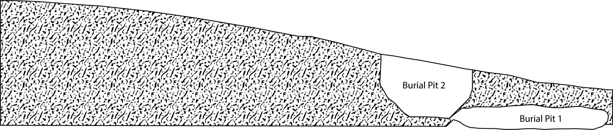
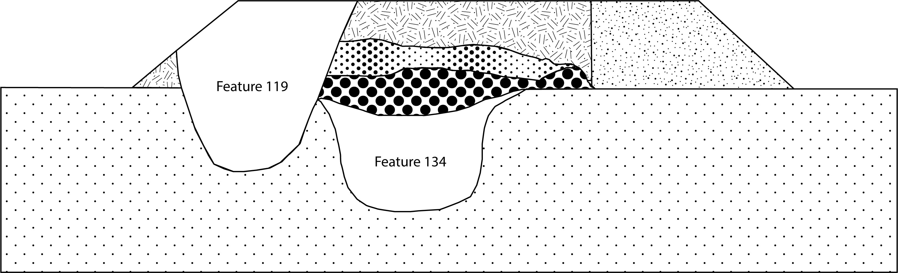

--- 
title: "Supplementary materials for article: Morphological trajectories of Gahagan bifaces from Caddo burial contexts"
author: 
    - Robert Z. Selden, Jr.^[Heritage Research Center, Stephen F. Austin State University; Department of Biology, Stephen F. Austin State University; and Cultural Heritage Department, Jean Monnet University, zselden@sfasu.edu], John E. Dockall^[Cox|McClain Environmental Consulting, Inc.], Christian S. Hoggard^[Department of Archaeology, University of Southampton], and David K. Thulman^[Department of Anthropology, George Washington University]
date: "`r Sys.Date()`"
site: bookdown::bookdown_site
documentclass: book
bibliography: [book.bib]
biblio-style: apalike
link-citations: yes
description: "Gahagan biface shape change."
---

# Preface {-}

>Reproducibility---the ability to recompute results---and replicability---the chances other experimenters will achieve a consistent result---are two foundational characteristics of successful scientific research [@RN20918].

## Basis of inquiry

Gahagan bifaces represent one of three categories of Caddo material culture that express a significant differences in morphology across the same geography as Caddo bottles and Perdiz arrow points [@RN11783;@RN11801;@RN11782;@RN11716;@RN8312]. The morphology of Gahagan bifaces from sites in central Texas was also found to differ significantly when compared with those recovered from the ancestral Caddo area [@RN21001]. That Gahagan bifaces have been found to differ across two spatial boundaries was noteworthy, particularly since it is regularly assumed that they were manufactured in central Texas and arrived in the ancestral Caddo area as products of trade or exchange [@RN11783;@RN21001]. Further, that Gahagan bifaces were found to differ across the same geographic area as Caddo bottles suggested that the temporal range of the _shape boundary_ might extend to the Formative/Early Caddo period (CE 800 - 1250); a notion that was later confirmed in a more comprehensive analysis of Caddo bottles [@RN8312].

This study shifts the analytical foci of the research program from one of regional trends to one of local Caddo burial contexts.

```{r gahagan bifaces 2D, out.width = "100%", dpi = 300, echo=TRUE, warning=FALSE, fig.cap="Gahagan bifaces from the northern and southern Caddo behavioral regions. Bifaces recovered with an individual denoted by black circles. Additional information for each bifaces, including the option to download 2D images of these bifaces, can be found at [https://scholarworks.sfasu.edu/ita-gahaganbiface/](https://scholarworks.sfasu.edu/ita-gahaganbiface/)."}
knitr::include_graphics('images/fig02.jpg')
```

## Primary findings

### Temporal change in preference

**Hypothesis 1: Gahagan bifaces selected for inclusion in Caddo burials differ in morphology through time.**

Hypothesis 1 is tested using two samples of Gahagan bifaces from Caddo burial contexts from the Mounds Plantation and George C. Davis sites where stratigraphy dictates differing temporal positions. The information gathered from the analysis provides valuable insights with regard to _design intent_ (for central Texas makers) and aesthetic preference (for Caddo users) that articulate with Gahagan bifaces at different temporal intervals.

#### _Hypothesis 1a: Temporal change in preference at Mounds Plantation_

In assessing a temporal change in preference between populations of bifaces from Mounds Plantation, those from burials included during mound development and/or construction (Burial pits 1, 5, and 8) are contrasted with those from Burial pit 2 which cuts into the corner of Burial Pit 1 in Mound 5, cutting downward from the mound's surface. The stratigraphic position of Burial Pit 2 indicates that the burial occurred after those associated with Burial Pits 1, 5, and 8.

```{r h1a, out.width = "100%", dpi = 300, echo=TRUE, warning=FALSE, fig.cap="Stratigraphic position of Burial Pits 1 and 2 at the Mounds Plantation site; adapted from Webb (1975:Figure 7). Burial Pit 2 is the only burial found to be intrusive from the mound surface."}

```

##### _Hypothesis 1a Findings_:

#### _Hypothesis 1b: Temporal change in preference at George C. Davis_

To assess the temporal change in preference between populations of bifaces from George C. Davis, those recovered from Feature 134 are contrasted with those from Feature 119. The stratigraphic position of Feature 119 indicates that the burials in that feature occurred after those associated with Feature 134.

```{r h1b, out.width = "100%", dpi = 300, echo=TRUE, warning=FALSE, fig.cap="Stratigraphic position of Features 119 and 134 at the George C. Davis site; adapted from Story (1997:Figure 13)."}

```

##### _Hypothesis 1b Findings_:

### General morphological trajectory

**Hypothesis 2: Gahagan bifaces included in Caddo burials as a cache offering differ in morphology from those placed with an individual.**

Hypothesis 2 is tested using a sample of Gahagan bifaces interred as part of a Caddo group offering (henceforth called a cache) or with a Caddo individual. Findings provide useful insights with regard to macro trends associated with the use-life of Gahagan bifaces, which may have ranged from a cache offering (where _design intent_ is assumed) to an individual offering (where minor modification(s)/retouch may be present).

#### _Hypothesis 2 Findings_:

## Acknowledgments

We extend our gratitude to the Caddo Nation of Oklahoma, the Williamson Museum at Northwestern State University, the Louisiana State Exhibit Museum, the Texas Archeological Research Laboratory at The University of Texas at Austin, the Brazos Valley Museum of Natural History, the Texas Parks and Wildlife Department, and the Sam Noble Oklahoma Museum of Natural Science for the requisite permissions and access needed to generate the 3D scans of the Gahagan bifaces. Thanks to Harry J. Shafer, Hiram F. (Pete) Gregory, Christian S. Hoggard, and David K. Thulman for their comments on the analyses of Gahagan biface shape. Thanks to Martin Hinz for fielding questions related to the oxcAAR package, and to Derek Hamilton for his guidance with the chronological models, and to Dean C. Adams, Michael L. Collyer, Emma Sherratt, Lauren Butaric, and Kersten Bergstrom for their constructive criticisms, general comments, and suggestions throughout the development of this research program.

## Funding

Components of this analytical work flow were developed and funded by a Preservation Technology and Training grant (P14AP00138) to RZS from the National Center for Preservation Technology and Training (NCPTT), and additional grants to RZS from the Caddo Tribe of Oklahoma, National Forests and Grasslands in Texas (15-PA-11081300-033) and the United States Forest Service (20-PA-11081300-074). Funding to scan the Gahagan bifaces at the Williamson Museum at Northwestern State University, Louisiana State Exhibit Museum, Texas Archeological Research Laboratory at The University of Texas at Austin, and Sam Noble Oklahoma Museum of Natural Science was provided to the RZS by the Heritage Research Center at Stephen F. Austin State University.

## Data management

This volume is written in _Markdown_, and all files needed to reproduce the analytical findings are included in the [GitHub repository](https://github.com/aksel-blaise/gahaganmorph3), which is digitally curated on the Open Science Framework. The reproducible nature of this undertaking provides a means for others to critically assess and evaluate the various analytical components [@RN20915;@RN20916;@RN20917], which is a necessary requirement for the production of reliable knowledge.

Reproducibility projects in [psychology](https://osf.io/ezcuj/) and [cancer biology](https://www.cos.io/rpcb) are impacting current research practices across all domains. Examples of reproducible research are becoming more abundant in archaeology [@RN20804;@RN21009;@RN11783;@RN21001], and the next generation of archaeologists are learning those tools and methods needed to reproduce and/or replicate research results [@RN21007]. Reproducible and replicable research work flows are often employed at the highest levels of humanities-based inquiries to mitigate concern or doubt regarding proper execution, and is of particular import should the results have---explicitly or implicitly---a major impact on scientific progress [@RN21008].

The analysis code associated with this project can be accessed through this document or the [GitHub](https://github.com/seldenlab/gahaganmorph.3) repository, which is digitally curated on the Open Science Framework [DOI: 10.17605/OSF.IO/JV3X8](https://osf.io/jv3x8/).

## Colophon

This version of the analysis was generated on `r Sys.time()` using the following computational environment and dependencies: 

```{r colophon, cache = FALSE}
# which R packages and versions were used?
if ("devtools" %in% installed.packages()) devtools::session_info()
```

Current Git commit details are:

```{r}
# where can I find this commit? 
if ("git2r" %in% installed.packages() & git2r::in_repository(path = ".")) git2r::repository(here::here())  
```
