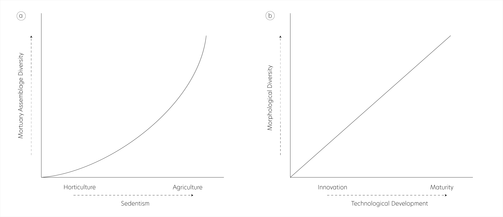

--- 
title: "Mortuary assemblage diversity, Gahagan biface morphology, and the evolution of a Caddo burial tradition in the American Southeast"
author: 
    - Robert Z. Selden, Jr.^[Heritage Research Center, Stephen F. Austin State University; Department of Biology, Stephen F. Austin State University; and Cultural Heritage Department, Jean Monnet University, zselden@sfasu.edu], John E. Dockall^[Stantec, Inc.], and David L. Carlson^[Department of Anthropology, Texas A&M University]
date: "`r Sys.Date()`"
site: bookdown::bookdown_site
bibliography: [book.bib]
biblio-style: apalike
link-citations: yes
description: "Gahagan biface shape change."
---

# Preface {-}

>Reproducibility---the ability to recompute results---and replicability---the chances other experimenters will achieve a consistent result---are two foundational characteristics of successful scientific research [@RN20918].

## Basis of inquiry

Exchange networks and interaction spheres functioned to establish, maintain, and formalize regional boundaries, traditions, and intergroup relationships. In the American Southeast, large formal bifaces and associated diagnostics represent stylistic items reflective of spatial and temporal change. Contextual differences in Caddo burials that included Gahagan bifaces indicate two discrete burial traditions; one where a biface was placed _atop or alongside an individual_ and another where a cache of Gahagan bifaces was placed _along the northern wall of the burial feature_. This exploratory study asks whether assemblage diversity and evenness, for mortuary contexts associated with Gahagan bifaces, increases through time, and whether Gahagan biface morphology may differ based on context. A seriation of mortuary contexts paired with an analysis of mortuary assemblage diversity highlights changes in Caddo burial assemblages through time, where the earliest contexts express lower diversity and evenness than later contexts. Results also indicate that Gahagan biface morphology differs between Caddo burial traditions, indicating discrete communities of practice related to object placement and shape preference. These findings provide the basis for a discussion of the establishment, maintenance, and evolution of a Caddo burial practice that occurs during the transition from a mobile horticulturist lifeway to one of emergent---and more sedentary---agriculturalists.

```{r gahagan.bifaces, out.width = "100%", dpi = 300, echo=TRUE, warning=FALSE, fig.cap="Gahagan bifaces from the northern and southern `Caddo behavioral regions`. Bifaces recovered atop or alongside an individual denoted by black dot. Additional information for each biface, including the option to download full-resolution 2D images of individual bifaces, can be found at [https://scholarworks.sfasu.edu/ita-gahaganbiface/](https://scholarworks.sfasu.edu/ita-gahaganbiface/)."}
knitr::include_graphics('images/fig02.jpg')
```

## Primary findings

```{r hypotheses, out.width = "100%", dpi = 300, echo=TRUE, warning=FALSE, fig.cap="Explanatory hypotheses include a, an increase in mortuary assemblage diversity as the Caddo became more sedentary during their shift from horticulturalism to an emergent agriculturalist lifeway; and b, an increase in morphological diversity through the technological life cycle."}

```

### ASSEMBLAGE DIVERSITY

**_Hypothesis_: Caddo mortuary assemblages associated with Gahagan bifaces increase in diversity subsequent to their initial use as mortuary offerings.**

This hypothesis is tested using counts of attributes and associated diagnostic artefacts recovered from Caddo mortuary contexts at the Mounds Plantation, George C. Davis, and Gahagan Mounds site where Gahagan bifaces were included as part of the mortuary assemblage. The hypothesis assesses whether diagnostic material culture objects included with Caddo burials became more diverse and evenly distributed among the types as burial practices evolved.

```{r abundance, out.width = "100%", dpi = 300, echo=TRUE, warning=FALSE, fig.cap="Relative abundance of a, adults and juveniles (binned to include all non-adults); b, lithic and ceramic artifacts; and c, diagnostic artefact types recovered from Caddo mortuary contexts that included a Gahagan biface. Contexts ordered temporally from bottom to top based on results of seriation (see Chapter 2). The middle two contexts (16RR1-BP2 and 16CD12-BP5) are interchangeable."}
knitr::include_graphics('images/abundance.png')
```

#### _Findings_:

- Juveniles are not present in the three latest assemblages that include Gahagan bifaces
- Lithics comprise 75% or more---in three cases, 100%---of those Caddo burial assemblages where Gahagan bifaces were recovered
- Caddo mortuary contexts that occur following initial deposition include a **significantly greater diversity** of associated diagnostics
- Caddo mortuary contexts that occur following initial deposition include **significantly greater evenness** across the types

```{r diversity.out, out.width = "100%", dpi = 300, echo=TRUE, warning=FALSE, fig.cap="Caddo burial assemblages that include Gahagan bifaces; 1, 41CE19-F134; 2, 41CE19-F119; 3, 16RR1-BP2; 4, 16RR1-BP3; 5, 16CD12-BP1; 6, 16CD12-BP2; 7, 16CD12-BP5; 8, 16CD12-BP8. The three sites in the lower part of the left quadrat exhibit lower diversity and evenness, and each represents the earliest context at each site to include a Gahagan biface. Those sites in the upper right quadrat have higher diversity and evenness, and occur later than those in the lower left quadrat."}
knitr::include_graphics('images/diversity2-1.png')
```

#### _Summary of results_

The hypothesis was tested using counts of associated diagnostic artefacts recovered from Caddo mortuary contexts at the Mounds Plantation, George C. Davis, and Gahagan Mound sites where Gahagan bifaces were included as part of the mortuary assemblage. The hypothesis assessed whether diagnostic material culture objects included with Caddo burials became more diverse and evenly distributed among the types as burial practices evolved. This follows with an expected increase in assemblage diversity during the cultural and subsistence-based transition from mobile horticulture to emergent--and more sedentary--agricultural communities.

Results demonstrate that lithics comprise 75% or more---in three cases, 100%---of those Caddo burial assemblages where Gahagan bifaces were recovered, as well as a significant increase in the diversity and evenness of diagnostic artefacts included in Caddo burial contexts with Gahagan bifaces. This general trend articulates with the development, maintenance, and evolution associated with a Caddo burial practice. These assemblages are dominated by lithic diagnostics, and ceramics are absent from three of the burial contexts. Further discussion related to diagnostic types that do/do not transcend specific spatial and temporal boundaries are included in the manuscript.

### OBJECT PLACEMENT

**_Hypothesis_: Gahagan bifaces included in Caddo burials as part of a cache differ in morphology from those placed atop or alongside an individual.**

This hypothesis is tested using Gahagan bifaces recovered from two discrete contexts; one interred as part of a _cache_, and the other placed atop or alongside _individuals_. Distinct Caddo burial practices may have constrained local morphological requirements, highlighting differential `shape preference`.

#### _Findings_:

- Gahagan bifaces **differ significantly in _shape_** between cache and individual contexts
- Gahagan bifaces do not differ in _size_ between cache and individual contexts
- Gahagan bifaces from individual contexts exhibit **significantly greater variation in size**

```{r b.context, out.width = "100%", dpi = 300, echo=TRUE, warning=FALSE, fig.cap="Comparison of Gahagan bifaces from cache and individual contexts. In the comparison of mean shapes, gray dots represent cache contexts, and black dots represent individual contexts."}
knitr::include_graphics('images/mshape-cache-ind.jpg')
```

#### Summary of results

Contextual differences suggest two distinct Caddo burial traditions associated with Gahagan bifaces; one more prevalent in the northern behavioral region where Gahagan bifaces were placed _atop or alongside an individual_, and one more prevalent in the southern behavioral region where six Gahagan bifaces were buried atop or alongside an individual, and the remainder were _included as a cache offering along the northern periphery of the burial_. Each burial tradition appears to have been bounded by its' own community of practice relating both to biface placement, and the design (shape) of Gahagan bifaces interred in each context.

### TEMPORAL TRAJECTORIES

**_Hypothesis_: Gahagan bifaces from _individual_ and _cache_ contexts differ through time---_initial_ vs. _subsequent_ deposition---as mortuary assemblage diversity increases.**

This hypothesis is tested using Gahagan bifaces recovered from four discrete contexts; the first interred with an _individual_ in the earliest (_initial_) burial context at each site, the second interred as part of a _cache_ in the earliest (_initial_) burial context at each site, the third interred with an _individual_ in _subsequent_ burial contexts, and the fourth interred as a _cache_ in _subsequent_ burial contexts. Distinct Caddo burial practices may have been constrained by local morphological requirements, highlighting aspects of differential shape preference as the diversity of Caddo mortuary assemblages increased.

The analysis employs _four discrete categories_ to assess morphological changes through time:

-   **Initial Individual**: from initial burial contexts that included Gahagan bifaces at each site, and interred atop or alongside an individual
-   **Initial Cache**: from initial burial contexts that included Gahagan bifaces at each site, and interred as part of a cache along the northern wall of the burial feature
-   **Subsequent Individual**: from subsequent burial contexts that included Gahagan bifaces at each site, and interred atop or alongside an individual
-   **Subsequent Cache**: from subsequent burial contexts that included Gahagan bifaces at each site, and interred as part of a cache along the northern wall of the burial feature

#### _Findings_:

-   Gahagan bifaces from _Initial Cache_ and _Subsequent Individual_ contexts **differ significantly in _shape_**
-   Gahagan bifaces from _Subsequent Cache_ and _Subsequent Individual_ contexts **differ significantly in _shape_**
-   Gahagan bifaces from _Initial Cache_ and _Initial Individual_ contexts **differ significantly in _size_**
-   Gahagan bifaces from _Initial Individual_ and _Subsequent Cache_ contexts **differ significantly in _size_**
-   Gahagan bifaces from _Initial Individual_ and _Subsequent Individual_ contexts **differ significantly in _size_**

```{r b.context.temporal, out.width = "100%", dpi = 300, echo=TRUE, warning=FALSE, fig.cap="In the comparison of Gahagan bifaces from discrete burial contexts, gray dots represent the mean shape at the top of the column, and black dots represent the mean shape at right. All comparisons in the first column differ significantly in size, those in the second column differ significantly in shape, and those in the third column do not differ in shape or size."}
knitr::include_graphics('images/comp.composite.jpg')
```

#### Summary of results

This hypothesis was tested using Gahagan bifaces recovered from four discrete contexts; the first interred with an _individual_ in the earliest (_initial_) burial context at each site, the second interred as part of a _cache_ in the earliest (_initial_) burial context at each site, the third interred with an _individual_ in _subsequent_ burial contexts, and the fourth interred as a _cache_ in _subsequent_ burial contexts. Distinct Caddo burial practices may have been constrained by local morphological requirements, highlighting aspects of differential preference as Caddo mortuary assemblage diversity increased. 

- Results demonstrate that in the earliest Caddo burials that included Gahagan bifaces, those bifaces placed atop or alongside an individual differ significantly in **size** (are larger) when compared with those placed in caches along the northern wall of the burial pit.

- In the later burials that included Gahagan bifaces, those bifaces placed atop or alongside an individual differ significantly in **shape** when compared with those placed in caches along the northern wall of the burial pit.
- Caches of Gahagan bifaces found along the northern wall of Caddo burial pits exhibit morphological stability through time in that they neither differ in shape nor size as the diversity of Caddo mortuary assemblages increases.

The temporal attribute used for the GM analysis is comprised of the same _initial_ and _subsequent_ contexts used in the analysis of assemblage diversity. That there are no cache offerings of Gahagan bifaces associated with the northern behavioral region raises questions regarding whether the spatial boundary may have been permeable, but in only one direction.

## Acknowledgments {-}

RZS extends his gratitude to the Caddo Nation of Oklahoma, the Caddo Nation Tribal Council, Tribal Chairman, and Tribal Historic Preservation Office for their guidance related to the development of the 3D scanning protocols, for permission and access to NAGPRA and previously repatriated collections, and for frank discussions related to language surrounding burial contexts associated with Caddo children. Additional thanks to the Williamson Museum at Northwestern State University, Louisiana State Exhibit Museum, Texas Archeological Research Laboratory at The University of Texas at Austin, Brazos Valley Museum of Natural History, Texas Parks and Wildlife Department, and Sam Noble Oklahoma Museum of Natural Science for providing access to the Gahagan bifaces. RZS expresses his gratitude to Carmen G. Montaña for discussions and guidance regarding measures of biological diversity and their application, and to Harry J. Shafer, Hiram F. (Pete) Gregory, Christian S. Hoggard, and David K. Thulman for their comments and constructive criticisms on the analyses of Gahagan biface morphology.

RZS thanks Christian S. Hoggard and David K. Thulman for their thoughtful comments and constructive criticisms of the landmarking protocol used in this study ([`LM3d1`](https://github.com/aksel-blaise/gahaganmorph2/blob/master/analysis/landmarking-protocol.md)), as well as the landmarking protocol for Gahagan bifaces that will be used in subsequent analytical efforts ([`LM3d2`](https://github.com/seldenlab/gahaganmorph.3/blob/main/lm3d2/03-landmarking-protocol.Rmd)); to Martin Hinz for fielding questions related to the `oxcAAR` package, and to Emma Sherratt, Kersten Bergstrom, Dean C. Adams, and Michael L. Collyer for their constructive criticisms, general comments, and suggestions throughout the development of this research program.

## Funding {-}

Components of this analytical work flow were developed and funded by a Preservation Technology and Training grant (P14AP00138) to RZS from the National Center for Preservation Technology and Training (NCPTT), and additional grants to RZS from the Caddo Tribe of Oklahoma, National Forests and Grasslands in Texas (15-PA-11081300-033) and the United States Forest Service (20-PA-11081300-074). Funding to scan the Gahagan bifaces at the Williamson Museum at Northwestern State University, Louisiana State Exhibit Museum, Texas Archeological Research Laboratory at The University of Texas at Austin, and Sam Noble Oklahoma Museum of Natural Science was provided to the RZS by the Heritage Research Center at Stephen F. Austin State University.

## Data management {-}

This volume is written in _Markdown_, and all files needed to reproduce the analytical findings are included in the [GitHub repository](https://github.com/seldenlab/gahaganmorph.3), which is digitally curated on the Open Science Framework. The reproducible nature of this undertaking provides a means for others to critically assess and evaluate the various analytical components [@RN20915;@RN20916;@RN20917], which is a necessary requirement for the production of reliable knowledge.

Reproducibility projects in [psychology](https://osf.io/ezcuj/) and [cancer biology](https://www.cos.io/rpcb) are impacting current research practices across all domains. Examples of reproducible research are becoming more abundant in archaeology [@RN20804;@RN21009;@RN11783;@RN21001;@RN9364], and the next generation of archaeologists are learning those tools and methods needed to reproduce and/or replicate research results [@RN21007]. Reproducible and replicable research work flows are often employed at the highest levels of humanities-based inquiries to mitigate concern or doubt regarding proper execution, and is of particular import should the results have---explicitly or implicitly---a major impact on scientific progress [@RN21008].

The analysis code associated with this project can be accessed through this document or the [GitHub](https://github.com/seldenlab/gahaganmorph.3) repository, which is digitally curated on the Open Science Framework [DOI: 10.17605/OSF.IO/Y7B39](https://osf.io/y7b39/).

## Colophon {-}

This version of the analysis was generated on `r Sys.time()` using the following computational environment and dependencies: 

```{r colophon, cache = FALSE}
# which R packages and versions were used?
if ("devtools" %in% installed.packages()) devtools::session_info()
```

Current Git commit details are:

```{r}
# where can I find this commit? 
if ("git2r" %in% installed.packages() & git2r::in_repository(path = ".")) git2r::repository(here::here())  
```
