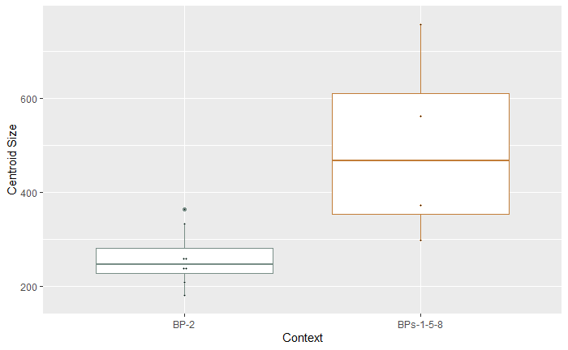

--- 
title: "Morphological trajectories suggest significant changes in preference and design intent associated with Gahagan bifaces from Caddo burials"
author: 
    - Robert Z. Selden, Jr.^[Heritage Research Center, Stephen F. Austin State University; Department of Biology, Stephen F. Austin State University; and Cultural Heritage Department, Jean Monnet University, zselden@sfasu.edu] and John E. Dockall^[Cox|McClain Environmental Consulting, Inc.]
date: "`r Sys.Date()`"
site: bookdown::bookdown_site
documentclass: book
bibliography: [book.bib]
biblio-style: apalike
link-citations: yes
description: "Gahagan biface shape change."
---

# Preface {-}

>Reproducibility---the ability to recompute results---and replicability---the chances other experimenters will achieve a consistent result---are two foundational characteristics of successful scientific research [@RN20918].

## Basis of inquiry

Gahagan bifaces differ in morphology across the same geography as Caddo bottles and Perdiz arrow points, and also between the Caddo and central Texas regions. This study asks whether Gahagan biface morphology differs between stratigraphically-defined---and chronologically discrete---burial contexts at the Mounds Plantation and George C. Davis sites, and whether Gahagan biface morphology may differ based on qualitative differences in Caddo burial practices. Results indicate a significant difference in size between burial contexts at Mounds Plantation and George C. Davis, where the pattern is inverted. At both sites, biface shape remains consistent and does not differ among contexts, indicating an established `shape preference` in the northern and southern behavioral regions that may have shifted significantly in size due to cyclical differences in the variable social mechanisms associated with raw material procurement. Gahagan bifaces also differ in shape between Caddo burial contexts where a biface was placed _alongside an individual_ and those found as part of a cache placed _alongside the northern wall of the burial feature_. Each burial tradition articulates with a distinct `community of practice` relating to Gahagan biface `placement` and `design intent`.

```{r gahagan bifaces 2D, out.width = "100%", dpi = 300, echo=TRUE, warning=FALSE, fig.cap="Gahagan bifaces from the northern and southern `Caddo behavioral regions`. Bifaces recovered atop or alongside an individual denoted by black dot. Additional information for each biface, including the option to download full-resolution 2D images of individual bifaces, can be found at [https://scholarworks.sfasu.edu/ita-gahaganbiface/](https://scholarworks.sfasu.edu/ita-gahaganbiface/)."}
knitr::include_graphics('images/fig02.jpg')
```

## Primary findings

### Temporal change in Caddo preference

**Hypothesis 1: Gahagan bifaces selected for inclusion in Caddo burials differ in morphology through time.**

Hypothesis 1 is tested using two samples of Gahagan bifaces from Caddo burial contexts at the Mounds Plantation and George C. Davis sites where stratigraphy dictates differing temporal positions. There is an important cultural distinction between archaeological contexts at Mounds Plantation and George C. Davis, in that all of the Gahagan bifaces from Mounds Plantation were recovered _in association with an individual_ (Burials 1, 2, 5, and 8) [@RN8174], and all of the Gahagan bifaces from George C. Davis articulate with _caches included along the northern periphery of two group burials_ (Features 119 and 134) [@RN3682;@RN8186]. The information gathered from the analysis provides valuable insights with regard to changes in `aesthetic preference`, as well as `design intent` for Gahagan bifaces recovered from discrete temporal intervals.

#### _Hypothesis 1a: Temporal change in Caddo preference at Mounds Plantation_

In assessing a temporal change in preference between Gahagan bifaces from Mound 5 at the Mounds Plantation site, those from burials included during mound development and/or construction (Burial Pits 1, 5, and 8) are contrasted with those from Burial Pit 2 which cuts into the corner of Burial Pit 1, cutting downward from the mound's surface [@RN8174]. The stratigraphic position of Burial Pit 2 indicates that this burial occurred after those associated with Burial Pits 1, 5, and 8 [@RN8174].

```{r h1a, out.width = "100%", dpi = 300, echo=TRUE, warning=FALSE, fig.cap="Stratigraphic position of Burial Pits 1 and 2 at the Mounds Plantation site; adapted from Webb (1975:Figure 7). Burial Pit 2 is the only burial found to be intrusive from the mound surface."}
knitr::include_graphics('images/h1a.jpg')
```

##### _Hypothesis 1a Findings_:

- Gahagan bifaces from BPs 1, 5, and 8 contexts do not differ in _shape_ from BP2
- Gahagan bifaces from BPs 1, 5, and 8 contexts **differ significantly** in _size_ from BP2
  - BP2 (later) bifaces are **significantly smaller** than the earlier bifaces from BPs 1, 5, and 8
  
```{r h1a.box, out.width = "100%", dpi = 300, echo=TRUE, warning=FALSE, fig.cap="Difference in centroid size between Gahagan bifaces from earlier (BPs 1, 5, and 8) and later (BP 2) contexts at the Mounds Plantation site."}

```

#### _Hypothesis 1b: Temporal change in Caddo preference at George C. Davis_

To assess the temporal change in preference between caches of Gahagan bifaces recovered from Mound C at the George C. Davis site, those from Feature 134 are contrasted with those from Feature 119 [@RN3682;@RN8186]. The stratigraphic position of Feature 119 indicates that the burials in that feature occurred subsequent to those associated with Feature 134 [@RN3682;@RN8186].

```{r h1b, out.width = "100%", dpi = 300, echo=TRUE, warning=FALSE, fig.cap="Stratigraphic position of Features 119 and 134 at the George C. Davis site; adapted from Story (1997:Figure 13)."}
knitr::include_graphics('images/h1b.jpg')
```

##### _Hypothesis 1b Findings_:

- Gahagan bifaces from F134 and F119 do not differ in _shape_
- Gahagan bifaces from F134 and F119 do not differ in _size_

```{r h1b.box, out.width = "100%", dpi = 300, echo=TRUE, warning=FALSE, fig.cap="Difference in centroid size between Gahagan bifaces from earlier (F134) and later (F119) contexts at the George C. Davis site."}

```

#### Hypothesis 1: Summary of results

Hypothesis 1 was tested using two samples of Gahagan bifaces from Caddo burial contexts at the Mounds Plantation and George C. Davis sites where stratigraphy dictates differing (earlier/later) temporal positions. There is an important cultural distinction between archaeological contexts at Mounds Plantation and George C. Davis, in that all of the Gahagan bifaces from Mounds Plantation were recovered _in association with an individual_ (Burials 1, 2, 5, and 8) [@RN8174], and all but two of the Gahagan bifaces from George C. Davis articulate with _caches included along the northern periphery of two group burials_ (Features 119 and 134) [@RN3682;@RN8186].

Previous studies have demonstrated a significant difference in shape between Gahagan bifaces recovered from the Mounds Plantation and George C. Davis sites [@RN11783]. In burials at Mounds Plantation, the Caddo were `selecting` for Gahagan bifaces that were significantly smaller in later contexts; a pattern that is not present at George C. Davis.

Chronometric dates associated with contexts yielding Gahagan bifaces leave much to be desired, and it is not possible at this time to order these burials using chronometric or relative dating methods. The results raise substantive questions regarding the cultural or social practices that were driving the temporal shift in size at Mounds Plantation. Might the size difference articulate with a shift in trading or exchange-based relationships with central Texas groups, and/or might the shift be related to a different functional use?

At both sites, shape remains consistent and does not differ between contexts, indicating an established `shape preference` that may have shifted at Mounds Plantation due to cyclical differences in the variable social mechanisms associated with raw material procurement. It may also be the case that the size difference was related to signaling, as well as the intended audience. For instance, larger bifaces selected for inclusion with caches may suggest that the intended audience was the group; representative of a potentially ostentatious display. The smaller Gahagan bifaces from individual burials may have been personal items belonging to the deceased, intended to signal status among personal contacts.

### Differential `design intent` of Gahagan bifaces

**Hypothesis 2: Gahagan bifaces included in Caddo burials as a cache differ in morphology from those placed atop or alongside an individual.**

Hypothesis 2 is tested using Gahagan bifaces from two discrete Caddo burial practices; one interred as part of a _cache_, and the other placed atop or alongside _individuals_. Distinct Caddo burial practices may have been constrained by local morphological requirements, highlighting aspects of differential `design intent`.

#### _Hypothesis 2 Findings_:

- Gahagan bifaces from cache and individual contexts **differ significantly** in _shape_
- Gahagan bifaces from cache and individual contexts do not differ in _size_

```{r h2.box, out.width = "100%", dpi = 300, echo=TRUE, warning=FALSE, fig.cap="There is a significant difference Gahagan biface shapes from _cache_ and _individual_ contexts. In the comparison of contexts, _cache_ is presented in gray, and _individual_ in black."}
knitr::include_graphics('images/mshape-cache-ind.jpg')
```

#### Hypothesis 2: Summary of results

Hypothesis 2 was tested using Gahagan bifaces that articulate with two distinct Caddo burial practices; one interred as part of a _cache_, and the other placed atop or alongside _individuals_. Burial practices may have been constrained by local morphological requirements, highlighting aspects of differential `design intent`.

Results highlight a significant difference in shape--but not size--for Gahagan bifaces included with Caddo burials. Contextual differences suggest two Caddo burial traditions associated with Gahagan bifaces; one more prevalent in the `northern behavioral region` where Gahagan bifaces were placed _atop or alongside an individual_, and one more prevalent in the `southern behavioral region` where Gahagan bifaces were _included as a cache offering along the northern periphery of the burial_. Each burial tradition appears to have been bounded by its' own `community of practice` relating to both the placement of the bifaces, and the design (shape) of the Gahagan bifaces used in each context.

While the northern `community of practice` appears to have been in operation at the same time as that of the southern `community of practice`, evidenced by individuals buried at Gahagan Mound and George C. Davis with Gahagan bifaces placed atop or alongside them, the inverse is not currently supported by the archaeological record. This raises questions regarding whether the northern burial tradition predates that of the south, and whether the `spatial boundary` was permeable, but in only one direction.

## Acknowledgments {-}

We extend our gratitude to the Caddo Nation of Oklahoma, the Williamson Museum at Northwestern State University, the Louisiana State Exhibit Museum, the Texas Archeological Research Laboratory at The University of Texas at Austin, the Brazos Valley Museum of Natural History, the Texas Parks and Wildlife Department, and the Sam Noble Oklahoma Museum of Natural Science for the requisite permissions and access needed to generate 3D scans of the Gahagan bifaces. Thanks to Harry J. Shafer, Hiram F. (Pete) Gregory, Christian S. Hoggard, and David K. Thulman for their comments on the analyses of Gahagan biface shape. 

RZS extends his gratitude to Christian S. Hoggard and David K. Thulman for their thoughtful comments and constructive criticisms of the landmarking protocol used in this study ([`LM3d1`](https://github.com/aksel-blaise/gahaganmorph2/blob/master/analysis/landmarking-protocol.md)), as well as the landmarking protocol for Gahagan bifaces that will be used in the next iteration of these analytical efforts ([`LM3d2`](https://seldenlab.github.io/gahaganmorph.3/landmarking-protocol-3d2.html)); to Martin Hinz for fielding questions related to the `oxcAAR` package, to Derek Hamilton for his guidance with the chronological models; and to Dean C. Adams, Michael L. Collyer, Emma Sherratt, Lauren Butaric, and Kersten Bergstrom for their constructive criticisms, general comments, and suggestions throughout the development of this research program.

## Funding {-}

Components of this analytical work flow were developed and funded by a Preservation Technology and Training grant (P14AP00138) to RZS from the National Center for Preservation Technology and Training (NCPTT), and additional grants to RZS from the Caddo Tribe of Oklahoma, National Forests and Grasslands in Texas (15-PA-11081300-033) and the United States Forest Service (20-PA-11081300-074). Funding to scan the Gahagan bifaces at the Williamson Museum at Northwestern State University, Louisiana State Exhibit Museum, Texas Archeological Research Laboratory at The University of Texas at Austin, and Sam Noble Oklahoma Museum of Natural Science was provided to the RZS by the Heritage Research Center at Stephen F. Austin State University.

## Data management {-}

This volume is written in _Markdown_, and all files needed to reproduce the analytical findings are included in the [GitHub repository](https://github.com/seldenlab/gahaganmorph.3), which is digitally curated on the Open Science Framework. The reproducible nature of this undertaking provides a means for others to critically assess and evaluate the various analytical components [@RN20915;@RN20916;@RN20917], which is a necessary requirement for the production of reliable knowledge.

Reproducibility projects in [psychology](https://osf.io/ezcuj/) and [cancer biology](https://www.cos.io/rpcb) are impacting current research practices across all domains. Examples of reproducible research are becoming more abundant in archaeology [@RN20804;@RN21009;@RN11783;@RN21001;@RN9364], and the next generation of archaeologists are learning those tools and methods needed to reproduce and/or replicate research results [@RN21007]. Reproducible and replicable research work flows are often employed at the highest levels of humanities-based inquiries to mitigate concern or doubt regarding proper execution, and is of particular import should the results have---explicitly or implicitly---a major impact on scientific progress [@RN21008].

The analysis code associated with this project can be accessed through this document or the [GitHub](https://github.com/seldenlab/gahaganmorph.3) repository, which is digitally curated on the Open Science Framework [DOI: 10.17605/OSF.IO/Y7B39](https://osf.io/y7b39/).

## Colophon {-}

This version of the analysis was generated on `r Sys.time()` using the following computational environment and dependencies: 

```{r colophon, cache = FALSE}
# which R packages and versions were used?
if ("devtools" %in% installed.packages()) devtools::session_info()
```

Current Git commit details are:

```{r}
# where can I find this commit? 
if ("git2r" %in% installed.packages() & git2r::in_repository(path = ".")) git2r::repository(here::here())  
```
